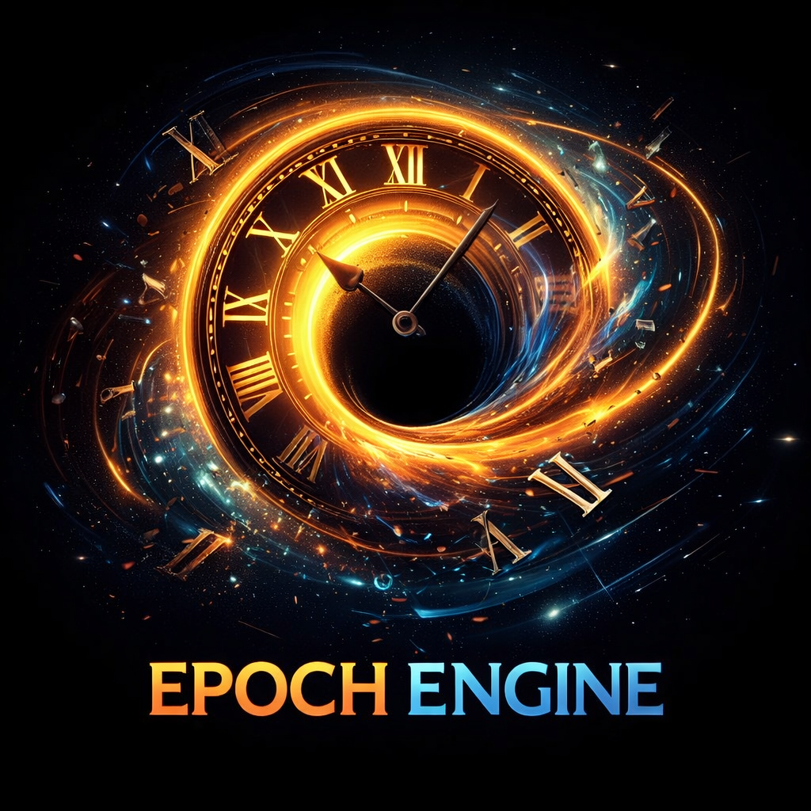
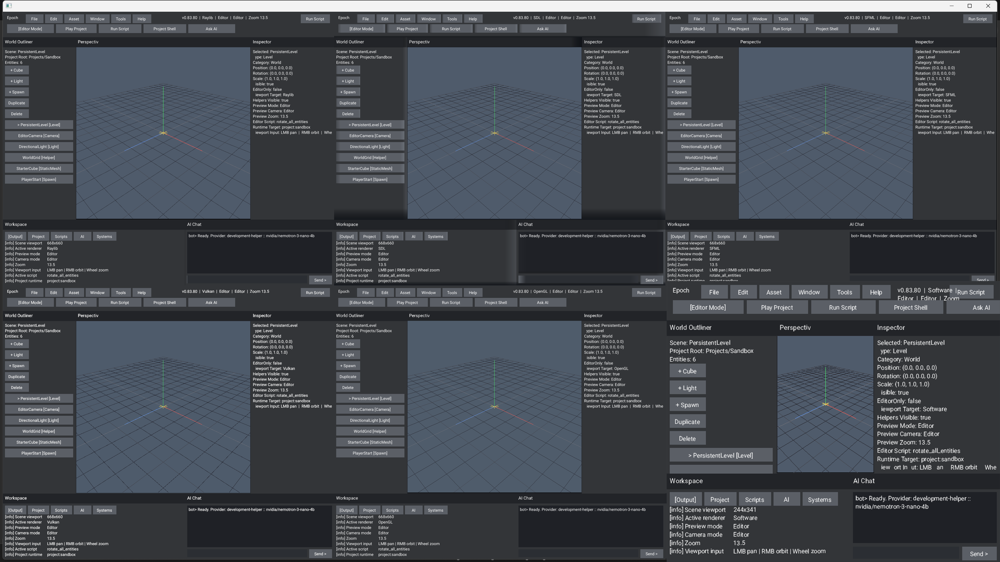
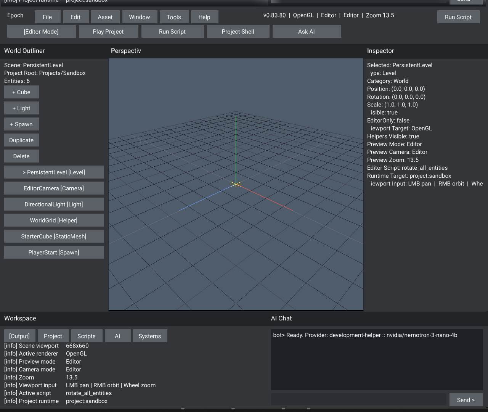
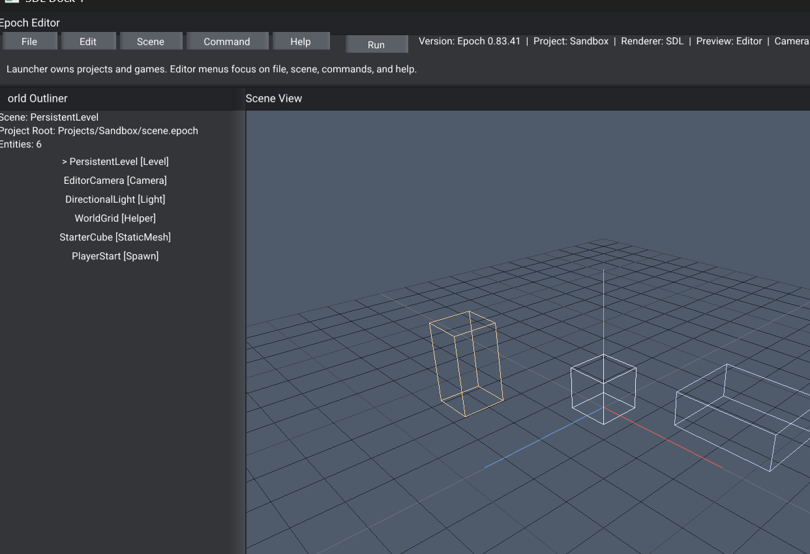
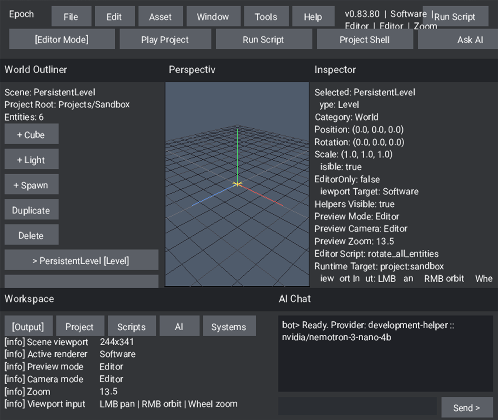
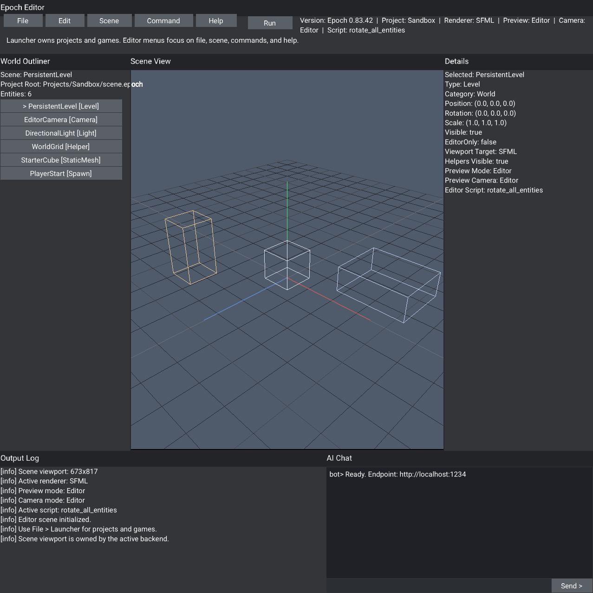

# Epoch - Creative Software And Game Engine

**Epoch Engine** is a professional **C++23 game engine and creative software
platform** for building games, editors, tools, pipelines, and real-time
interactive systems from a single modern codebase. It combines a
modules-first architecture, two engine AI runtime roles under one
engine-owned surface, custom UI powered by an automated texture-atlas
system, built-in C++23 scripting that compiles with the engine and project,
multi-context rendering, launcher + editor workflows, a project-driven
runtime built around engine projects and scenes, and a shared time-system
spine that treats simulation pacing, pause/resume, scaling, and stepping as
first-class engine ownership instead of ad hoc per-backend behavior.

<p align="left">
  
  
  
  
  
  
</p>

The active engine lives in:

```text
Engine/src/
Engine/include/
Engine/modules/
Engine/resource/
Engine/ai/
```

with prebuilt MSVC runtime binaries commonly landing in:

```text
x64/Debug/
x64/Release/
```

Those binary folders also carry runtime assets, so launching from the binary
directory is the safest default for local testing.

For Windows multi-context smoke tests, prefer launching directly from
`x64/Debug/` or `x64/Release/` so docked SDL/SFML/Vulkan panes see the same
asset set as the main editor host.

---

# What Epoch provides

- A project-driven runtime shell that creates, selects, builds, and plays real
  game or software projects instead of trapping the editor in fake sample flows.
- An embedded-engine project path that is being shaped around headers, modules,
  source, scripting, and resources together so generated child builds can
  graduate into honest standalone work.
- Custom UI, text, and workspace tooling built on Epoch's own automated
  texture-atlas system instead of delegating editor behavior to middleware UI.
- Engine-owned C++23 compiled scripting with project-local source resolution,
  host callbacks, validation/build actions, and runtime execution from the live
  editor shell.
- Multicontext backend orchestration across OpenGL, Vulkan, SDL3, Raylib, SFML,
  software, and headless/noop paths, with shared preview math keeping scene
  framing closer across the visible renderers.
- A Systems workspace that is becoming a real tooling surface for frame/task
  graph views, support-tier diagnostics, pacing visibility, and deeper
  renderer/runtime instrumentation.
- A time-based engine spine that owns fixed-step simulation, frame pacing,
  pause/resume, scaling, single-step control, and future replay/timeline hooks
  instead of leaving timing scattered across backends.
- Two intentional in-engine AI roles, the internal EpochBot and the local
  MCP/control layer, with external local LLMs used as development helpers for
  drafting, testing, evaluation, and documentation acceleration.
- Broad hardware support aimed at 6-core / GTX 1660 Ti-era desktops and modern
  Linux laptops by default, with heavier renderer features and extra libs kept
  behind explicit support tiers or project opt-in.
- Cross-platform build freedom through Visual Studio, MSBuild, CMake presets,
  VS Code, shell scripts, and a module-first C++23 public surface that is still
  being cleaned up toward more professional naming.

---

# In action

These README captures are source-state proofs, not updater-shell screenshots.
The current six-context proof is promoted from engine-generated capture outputs
so the repo image stays aligned with the real editor/runtime state.
If a packaged bootstrap release looks older than these, it has not caught up to
the current source/editor state yet.

- A valid six-context proof must visibly show `Raylib`, `SDL`, `SFML`,
  `Vulkan`, `OpenGL`, and `Software`.
- Parent/helper host windows must not become stray fake panes. For the current
  stable Windows parented path, the visible top-row panes are the real
  `GLFW30`, `SDL_app`, and `SFML_Window` child surfaces, while the old
  `EpochChild` wrappers stay hidden.
- Black or empty software captures do not count as proof.
- Refresh the multicontext proof at least every 10th feature version, or
  sooner whenever renderer color, docking, context visibility, or layout
  behavior changes enough to make the older image misleading.
- Capture from an asset-bearing `x64/Debug/` or `x64/Release/` launch only.

Windows fullscreen six-context multicontext proof, source `v0.83.80`:

<p align="center">
  
</p>

Open the PNG directly for native resolution when checking all six panes. GitHub's
page scaling can make the third column and lower row harder to read at a glance.

---

Windows backend proof crops, refreshed from the latest fullscreen six-context
source proof:

<p align="center">
  
  
  
</p>

---

WSL/Linux editor proof, source `v0.83.42`:

<p align="center">
  
</p>

WSL/Linux note:

- The Linux screenshot above comes from the engine's own frame capture under WSLg, which avoids the extra-window behavior that can make desktop grabs misleading.
- The broader Linux multi-window view is still visually inconsistent under WSLg, so the README is using the clean single-backend editor proof for now.

---

# Repository layout

```text
Engine/
```

Engine code, build configuration, resources, examples, docs, assets, and
editor/runtime systems.

```text
Engine/ai/
```

Repo-safe AI datasets, schemas, evals, manifests, tokenizer metadata, and
prompt templates. Raw captures, checkpoints, and model weights stay local.

```text
x64/
```

MSVC runtime outputs and colocated runtime assets for local launches.

```text
Changes/
```

Active changelog, roadmap, and current release notes.

```text
Images/
```

Repository artwork and README assets.

```text
Tools/
```

Local helper scripts and tooling notes.

---

# Build systems

## Visual Studio 2022

Open the solution at:

```text
Engine.sln
```

Typical configuration:

- `Debug | x64`
- `Release | x64`

Primary engine project surfaces:

- [Engine/Engine.vcxitems](Engine/Engine.vcxitems)
- [Engine/examples/StaticLib1/StaticLib1.vcxproj](Engine/examples/StaticLib1/StaticLib1.vcxproj)
- [Engine/examples/ConsoleApplication1/ConsoleApplication1.vcxproj](Engine/examples/ConsoleApplication1/ConsoleApplication1.vcxproj)

## MSBuild

From the repository root in Developer PowerShell:

```powershell
& "C:\Program Files\Microsoft Visual Studio\2022\Community\MSBuild\Current\Bin\MSBuild.exe" Engine.sln /t:Rebuild /p:Configuration=Debug /p:Platform=x64 /m:1
```

To build the example app only:

```powershell
& "C:\Program Files\Microsoft Visual Studio\2022\Community\MSBuild\Current\Bin\MSBuild.exe" Engine.sln /t:ConsoleApplication1 /p:Configuration=Debug /p:Platform=x64 /m:1
```

## CMake Presets

Presets live at [Engine/CMakePresets.json](Engine/CMakePresets.json).

Windows MSVC:

```powershell
Set-Location Engine
cmake --preset x64-debug
cmake --build --preset x64-debug
```

Windows Clang:

```powershell
Set-Location Engine
cmake --preset clang-x64-debug
cmake --build --preset clang-x64-debug
```

Windows GCC / MinGW:

```powershell
Set-Location Engine
cmake --preset gcc-x64-debug
cmake --build --preset gcc-x64-debug
```

Linux:

```bash
cd Engine
cmake --preset Ninja-Debug
cmake --build --preset Ninja-Debug
```

macOS:

```bash
cd Engine
cmake --preset macos-debug
cmake --build --preset macos-debug
```

## VS Code

VS Code workspace configuration lives in:

```text
Engine/.vscode/
```

Key files:

- [Engine/.vscode/tasks.json](Engine/.vscode/tasks.json)
- [Engine/.vscode/launch.json](Engine/.vscode/launch.json)
- [Engine/.vscode/settings.json](Engine/.vscode/settings.json)
- [Engine/.vscode/c_cpp_properties.json](Engine/.vscode/c_cpp_properties.json)
- [Engine/.vscode/cmake-kits.json](Engine/.vscode/cmake-kits.json)

Recommended flow:

1. Open `Engine/` in VS Code.
2. Select a CMake preset or task matching your compiler.
3. Build through the bundled tasks or the CMake Tools extension.

## Shell scripts

Scripted build helpers:

- [Engine/build.sh](Engine/build.sh)
- [Engine/run.sh](Engine/run.sh)
- [Engine/install.sh](Engine/install.sh)
- [Engine/clean.sh](Engine/clean.sh)

Examples:

```bash
cd Engine
./build.sh gcc Release
./run.sh gcc Release
```

WSL note:

- The packaged Linux updater shell can also be smoke-tested under Windows WSL2.
- Use a WSLg/X11 setup with working OpenGL, extract the Linux release asset inside WSL, then launch `./epoch`.
- The Linux updater shell now prefers OpenGL by default on Linux/WSL; you can still force `--backend software` if you need the CPU path.

---

# Running the MSVC binaries

Launch from the binary directory so the colocated assets resolve cleanly:

```powershell
Set-Location x64/Debug
.\ConsoleApplication1.exe
```

Release build:

```powershell
Set-Location x64/Release
.\ConsoleApplication1.exe
```

Relevant runtime asset roots:

- `x64/Debug/assets/`
- `x64/Release/assets/`
- `Engine/assets/`

---

# Documentation map

Documentation index: [Engine/docs/README.md](Engine/docs/README.md)

Useful entry points:

- [Engine/docs/build_presets.md](Engine/docs/build_presets.md)
- [Engine/docs/build_scripts.md](Engine/docs/build_scripts.md)
- [Engine/docs/ai_build_memory.md](Engine/docs/ai_build_memory.md)
- [Engine/docs/tools_list.md](Engine/docs/tools_list.md)
- [Engine/docs/runtime_operations.md](Engine/docs/runtime_operations.md)
- [Engine/docs/aengineconfig_flags.md](Engine/docs/aengineconfig_flags.md)
- [Engine/docs/engine_analysis.md](Engine/docs/engine_analysis.md)
- [Engine/docs/context_audit.md](Engine/docs/context_audit.md)
- [Engine/docs/menu_overlay_backend_audit.md](Engine/docs/menu_overlay_backend_audit.md)
- [Engine/docs/renderer_regression_plan.md](Engine/docs/renderer_regression_plan.md)
- [Engine/docs/wsl_vcpkg_setup.md](Engine/docs/wsl_vcpkg_setup.md)
- [Changes/release_notes_archive.md](Changes/release_notes_archive.md)

---

# Current snapshot

<p align="left">
  
  
  
</p>

Highlights:
- The source tree is now on `v0.83.83`, and this pass removes the lingering
  MSVC `C5202` mixed-module warning from `Engine/src/runtime.cpp` instead of
  normalizing compiler noise.
- The Project workspace now exposes a real child-build path for generated
  shells, including entry source, project file, build script, build log, and
  expected Debug output executable.
- Generated child projects now land under repo-level `Projects/`, create the
  broader embedded-engine surface (`include`, `modules`, `source`, `scripts`,
  `resource`, `assets`), and emit `project.paths.txt` so file creation/build
  output can be traced directly from editor logs.
- Project-local script compilation now searches project and repo engine surfaces
  more honestly instead of assuming a single fragile include root.
- The Win32 parented multicontext path now requests a grid relayout after pane
  removal, which tightens the first-slot collapse case the older layout was
  leaving behind.
- The shared preview marker and editor preview camera bookkeeping now track
  per-context state honestly instead of collapsing different panes onto one
  preview-camera key.
- The parent shell and editor palette have been pulled back toward a calmer dark
  treatment, but the README fullscreen six-context proof is intentionally not
  refreshed in this pass because SDL/SFML proxy-host redock visibility is still
  an active multicontext follow-up.
- The Windows parented multicontext path now revalidates on the real child
  surfaces: Raylib/SDL/SFML all undock and redock cleanly in the harness, the
  maximized six-context grid stays fitted, and an early visible `SFML_Window`
  close still does not kill the parent editor. The helper `EpochChild` proxy
  hosts are expected to return hidden under the parent after redock instead of
  lingering as floating top-level wrappers.
- The AI workspace now promotes staged MCP/control snapshots into curated
  datasets too, instead of leaving that part of the two-role training loop as
  documentation-only.
- The roadmap is now GitHub-ready markdown at
  [Changes/roadmap.md](Changes/roadmap.md), and it explicitly tracks naming
  cleanup debt, the six-month 2D priority track, the time-system spine, the
  two-role AI training path, and the later procedural/time-node authoring
  phase.
- Detailed release history lives in [Changes/changelog.txt](Changes/changelog.txt),
  [Changes/release_notes_archive.md](Changes/release_notes_archive.md), and the
  current version notes under [Changes/](Changes/).

Changelog:

[Changes/changelog.txt](Changes/changelog.txt)

Roadmap:

[Changes/roadmap.md](Changes/roadmap.md)

---

# License

```text
LicenseRef-MIT-NoSell
```

See [LICENSE](LICENSE) for full terms.
