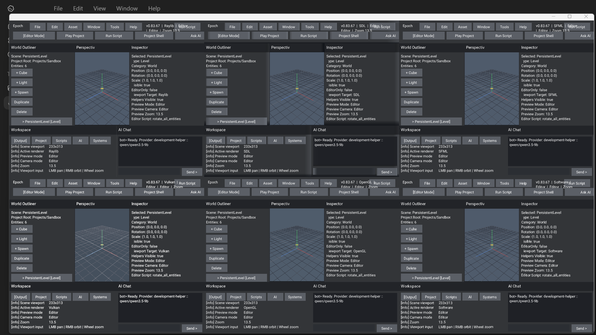

# Epoch - Creative Software And Game Engine

**Epoch Engine** is a professional **C++23 game engine and creative software
platform** for building games, editors, tools, pipelines, and real-time
interactive systems from a single modern codebase. It combines a
modules-first architecture, two engine AI runtime roles under one
engine-owned surface, custom UI powered by an automated texture-atlas
system, built-in C++23 scripting that compiles with the engine and project,
multi-context rendering, launcher + editor workflows, a project-driven
runtime built around engine projects and scenes, and a shared time-system
spine that treats simulation pacing, pause/resume, scaling, and stepping as
first-class engine ownership instead of ad hoc per-backend behavior.

The active engine lives in:

```text
Engine/src/
Engine/include/
Engine/modules/
Engine/resource/
Engine/ai/
```

with prebuilt MSVC runtime binaries commonly landing in:

```text
x64/Debug/
x64/Release/
```

Those binary folders also carry runtime assets, so launching from the binary
directory is the safest default for local testing.

For Windows multi-context smoke tests, prefer launching directly from
`x64/Debug/` or `x64/Release/` so docked SDL/SFML/Vulkan panes see the same
asset set as the main editor host.

---

# What Epoch provides

- Internalized engine bootstrap and entry-point flexibility. Epoch can own the
  desktop startup path itself or be embedded with handled/headless entry
  configurations through the active `EPOCH_*` runtime macros. See
  [configuration flags](Engine/docs/aengineconfig_flags.md) and
  [runtime operations](Engine/docs/runtime_operations.md).
- Two engine AI runtime roles under one engine-owned surface: the internal
  EpochBot and the local MCP/control layer that can both operate the engine and
  train EpochBot while the engine is being used and built.
- External local LLMs such as LM Studio are development helpers for testing,
  evaluation, dataset cleanup, documentation acceleration, and editor/build
  assistance. They are not a third engine runtime role.
- Multi-context, multi-backend runtime orchestration across OpenGL, Vulkan,
  SDL3, Raylib, SFML, software, and noop/headless paths.
- Project-driven workflow that routes projects into the editor and scene play
  into runtime mode, instead of treating the editor as a loose debug shell or a
  permanent launcher for sample games.
- A real project shell direction with editor-first launcher profiles plus the
  first generated game-project and software/tool-project shell flow, so Epoch
  can bootstrap work the way a serious engine or creative IDE should.
- Generated project shells are expected to support both duplicated engine-source
  layouts and static engine integration through `Engine/include/` when a
  project compiles the engine directly into its own source tree.
- A software-development path alongside the game path, so the same engine shell
  can generate and run creative tools, editors, and application-style projects
  instead of pretending every project is only a game.
- A time-based engine direction in the simulation sense, with fixed-step
  ownership, pacing diagnostics, pause/resume, time scaling, single-step
  control, and future replay/timeline hooks being folded into the core engine
  instead of left to one-off subsystems.
- Desktop-style editor workflow with scene preview control, command surfaces,
  a modular workspace shell for project/scripts/systems/AI/output docks, and
  backend-aware fallback behavior.
- Custom GUI, sprite, and text pipelines built on the engine's own automated
  texture/atlas system rather than copied independently into each backend.
- ECS-style systems, scene plumbing, gameplay modules, and engine-owned runtime
  state.
- Built-in C++23 scripting that compiles as part of the engine/project, with
  editor-triggered run actions, a host API for runtime/editor callbacks, and
  task-graph-backed asynchronous work scheduling.
- Diagnostics, renderer telemetry, runtime logging, and updater plumbing as
  first-class engine systems.
- A Systems workspace that now renders engine-generated frame/task graph
  textures with pan/zoom controls, support-tier diagnostics, and the first
  shared time-spine diagnostics, and is explicitly moving toward deeper
  multithreaded renderer tooling instead of staying a fake placeholder.
- Broad automatic hardware support as a first-class target, centered on
  6-core / GTX 1660 Ti-era desktops and modern Linux laptops by default, with
  heavier backend/lib support exposed as project-level opt-in tiers.
- A modern but practical renderer direction: GPU-driven baseline first,
  centered on visibility -> surface -> lighting -> temporal ->
  reconstruction -> present, with heavier techniques kept behind support tiers
  or explicit project opt-in.
- A later procedural world and time-node authoring phase for SpeedTree-like
  modular asset/world workflows, with future O2L integration documented as a
  source for that phase instead of a current dependency.
- Cross-platform build freedom: Visual Studio, MSBuild, CMake presets, VS Code,
  shell-script workflows, and multiple compiler families across Windows, Linux,
  and macOS.
- Module-first public engine surface centered around active C++23 modules and
  the exported [epochengine module](Engine/modules/epochengine.ixx).
- Naming is still converging. Legacy/orphan names from older `aengine*` eras
  remain transitional debt, and the roadmap now treats consistent professional
  module/file naming as a real cleanup track instead of leaving it implicit.

---

# In action

These README captures are editor/source proofs, not updater-shell screenshots.
If a packaged bootstrap release looks older than these, it has not caught up to
the current source/editor state yet. The multicontext proof should refresh at
least every 10th feature version, or sooner whenever visible renderer color,
docking, context visibility, or layout behavior changes enough to make the old
proof misleading.

Windows editor six-context multicontext proof, source `v0.83.67`:

<p align="center">
  
</p>

---

Windows editor backend proofs, source `v0.83.41`:

<p align="center">
  
  
  
</p>

---

WSL/Linux editor proof, source `v0.83.42`:

<p align="center">
  
</p>

WSL/Linux note:

- The Linux screenshot above comes from the engine's own frame capture under WSLg, which avoids the extra-window behavior that can make desktop grabs misleading.
- The broader Linux multi-window view is still visually inconsistent under WSLg, so the README is using the clean single-backend editor proof for now.

---

# Repository layout

```text
Engine/
```

Engine code, build configuration, resources, examples, docs, assets, and
editor/runtime systems.

```text
Engine/ai/
```

Repo-safe AI datasets, schemas, evals, manifests, tokenizer metadata, and
prompt templates. Raw captures, checkpoints, and model weights stay local.

```text
x64/
```

MSVC runtime outputs and colocated runtime assets for local launches.

```text
Changes/
```

Active changelog, roadmap, and current release notes.

```text
Images/
```

Repository artwork and README assets.

```text
Tools/
```

Local helper scripts and tooling notes.

---

# Build systems

## Visual Studio 2022

Open the solution at:

```text
Engine.sln
```

Typical configuration:

- `Debug | x64`
- `Release | x64`

Primary engine project surfaces:

- [Engine/Engine.vcxitems](Engine/Engine.vcxitems)
- [Engine/examples/StaticLib1/StaticLib1.vcxproj](Engine/examples/StaticLib1/StaticLib1.vcxproj)
- [Engine/examples/ConsoleApplication1/ConsoleApplication1.vcxproj](Engine/examples/ConsoleApplication1/ConsoleApplication1.vcxproj)

## MSBuild

From the repository root in Developer PowerShell:

```powershell
& "C:\Program Files\Microsoft Visual Studio\2022\Community\MSBuild\Current\Bin\MSBuild.exe" Engine.sln /t:Rebuild /p:Configuration=Debug /p:Platform=x64 /m:1
```

To build the example app only:

```powershell
& "C:\Program Files\Microsoft Visual Studio\2022\Community\MSBuild\Current\Bin\MSBuild.exe" Engine.sln /t:ConsoleApplication1 /p:Configuration=Debug /p:Platform=x64 /m:1
```

## CMake Presets

Presets live at [Engine/CMakePresets.json](Engine/CMakePresets.json).

Windows MSVC:

```powershell
Set-Location Engine
cmake --preset x64-debug
cmake --build --preset x64-debug
```

Windows Clang:

```powershell
Set-Location Engine
cmake --preset clang-x64-debug
cmake --build --preset clang-x64-debug
```

Windows GCC / MinGW:

```powershell
Set-Location Engine
cmake --preset gcc-x64-debug
cmake --build --preset gcc-x64-debug
```

Linux:

```bash
cd Engine
cmake --preset Ninja-Debug
cmake --build --preset Ninja-Debug
```

macOS:

```bash
cd Engine
cmake --preset macos-debug
cmake --build --preset macos-debug
```

## VS Code

VS Code workspace configuration lives in:

```text
Engine/.vscode/
```

Key files:

- [Engine/.vscode/tasks.json](Engine/.vscode/tasks.json)
- [Engine/.vscode/launch.json](Engine/.vscode/launch.json)
- [Engine/.vscode/settings.json](Engine/.vscode/settings.json)
- [Engine/.vscode/c_cpp_properties.json](Engine/.vscode/c_cpp_properties.json)
- [Engine/.vscode/cmake-kits.json](Engine/.vscode/cmake-kits.json)

Recommended flow:

1. Open `Engine/` in VS Code.
2. Select a CMake preset or task matching your compiler.
3. Build through the bundled tasks or the CMake Tools extension.

## Shell scripts

Scripted build helpers:

- [Engine/build.sh](Engine/build.sh)
- [Engine/run.sh](Engine/run.sh)
- [Engine/install.sh](Engine/install.sh)
- [Engine/clean.sh](Engine/clean.sh)

Examples:

```bash
cd Engine
./build.sh gcc Release
./run.sh gcc Release
```

WSL note:

- The packaged Linux updater shell can also be smoke-tested under Windows WSL2.
- Use a WSLg/X11 setup with working OpenGL, extract the Linux release asset inside WSL, then launch `./epoch`.
- The Linux updater shell now prefers OpenGL by default on Linux/WSL; you can still force `--backend software` if you need the CPU path.

---

# Running the MSVC binaries

Launch from the binary directory so the colocated assets resolve cleanly:

```powershell
Set-Location x64/Debug
.\ConsoleApplication1.exe
```

Release build:

```powershell
Set-Location x64/Release
.\ConsoleApplication1.exe
```

Relevant runtime asset roots:

- `x64/Debug/assets/`
- `x64/Release/assets/`
- `Engine/assets/`

---

# Documentation map

Documentation index: [Engine/docs/README.md](Engine/docs/README.md)

Useful entry points:

- [Engine/docs/build_presets.md](Engine/docs/build_presets.md)
- [Engine/docs/build_scripts.md](Engine/docs/build_scripts.md)
- [Engine/docs/ai_build_memory.md](Engine/docs/ai_build_memory.md)
- [Engine/docs/tools_list.md](Engine/docs/tools_list.md)
- [Engine/docs/runtime_operations.md](Engine/docs/runtime_operations.md)
- [Engine/docs/aengineconfig_flags.md](Engine/docs/aengineconfig_flags.md)
- [Engine/docs/engine_analysis.md](Engine/docs/engine_analysis.md)
- [Engine/docs/context_audit.md](Engine/docs/context_audit.md)
- [Engine/docs/menu_overlay_backend_audit.md](Engine/docs/menu_overlay_backend_audit.md)
- [Engine/docs/renderer_regression_plan.md](Engine/docs/renderer_regression_plan.md)
- [Engine/docs/wsl_vcpkg_setup.md](Engine/docs/wsl_vcpkg_setup.md)
- [Changes/release_notes_archive.md](Changes/release_notes_archive.md)

---

# Current snapshot

Version:

```text
v0.83.67
```

Highlights:
- The Windows parented multicontext host now auto-fits the desktop work area so
  the honest six-context editor proof can stay visible on normal hardware
  instead of drifting off-screen.
- SDL, SFML, Vulkan, Raylib, OpenGL, and Software are all back in the fitted
  editor proof with the shared position marker visible again and the fake
  preview placeholder boxes removed.
- The project/scripting direction is now documented around both generated
  engine-source projects and the static engine-include path, while naming debt
  such as legacy `aengine*`/`multiplexer` labels is explicitly part of the
  cleanup roadmap.
- JSON and JSONL training data remain Git-safe and curatable in-repo, while
  checkpoints, compiled local models, and caches stay local-only.
- The roadmap now treats 6-core / 1660 Ti-era desktops and modern Linux
  laptops as the default automatic compatibility baseline, with heavier support
  tiers exposed as developer opt-in choices per project.

- `0.83.54` wires real Win32 wheel and text/key events back into the docked
  editor GUI path, which restores wheel zoom and gives the AI chat a live input
  route instead of the dead placeholder behavior.
- The preview look-hit marker now sits on the grid plane as a proper targeting
  cross instead of hovering above the scene with a false camera-to-hit stem.
- The editor now exposes real entity controls for adding meshes, lights, and
  spawns, plus duplicating or deleting the current selection from the active UI
  surfaces instead of logging placeholder actions.
- The software renderer now tracks camera revisions directly and reduces
  repeated telemetry churn so it spends less time redrawing stale editor frames.
- The refreshed 4K six-context editor proof above was captured from the real
  asset-bearing `x64/Debug` runtime so it matches the current local launch path.
- The repo still keeps Windows resources under `Engine/resource/`, separate
  from both implementation code and module interfaces.
- Detailed release history lives in [Changes/changelog.txt](Changes/changelog.txt),
  [Changes/release_notes_archive.md](Changes/release_notes_archive.md), and the
  current version notes under [Changes/](Changes/).

Changelog:

[Changes/changelog.txt](Changes/changelog.txt)

Roadmap:

[Changes/roadmap.txt](Changes/roadmap.txt)

---

# License

```text
LicenseRef-MIT-NoSell
```

See [LICENSE](LICENSE) for full terms.
