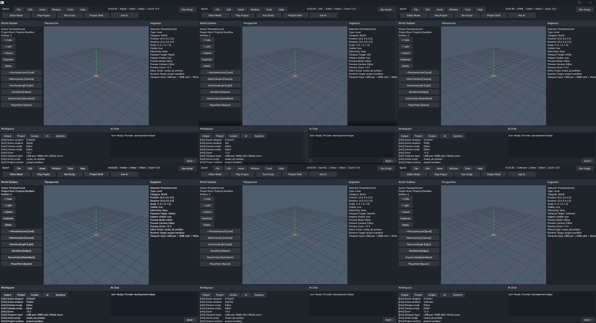

# Epoch - Creative Software And Game Engine

**Epoch Engine** is a professional **C++23 game engine and creative software
platform** for games, editors, tools, automation, and real-time interactive
workflows from one codebase. The active source tree is centered on a
modules-first engine surface, a project-driven editor/runtime flow, custom UI
and text rendering through Epoch's atlas system, engine-owned C++23 scripting,
multi-context rendering, and a staged two-role AI workspace that keeps helper
automation reviewable instead of pretending blind autonomy is already solved.

<p align="left">
  
  
  
  
  
  
</p>

The active engine lives in:

```text
Engine/src/
Engine/include/
Engine/modules/
Engine/resource/
Engine/ai/
```

with prebuilt MSVC runtime binaries commonly landing in:

```text
x64/Debug/
x64/Release/
```

Those binary folders carry runtime assets too, so launching from the binary
directory is the safest default for local testing. For Windows multicontext
validation, prefer `x64/Debug/` or `x64/Release/` so SDL/SFML/Vulkan panes see
the same asset set as the main editor host.

---

# What Epoch provides

- A project-driven runtime shell that creates, selects, builds, and plays real
  game or software projects instead of trapping the editor in fake sample
  flows.
- A split shell visual direction: the launcher can keep its classic steel
  palette while the editor stays on a darker neutral tool palette, with a
  future settings-level theme selector still planned once scoped GUI themes are
  fully stabilized.
- An embedded-engine project path that is being shaped around headers, modules,
  source, scripting, and resources together so generated child builds can
  graduate into honest standalone work.
- Custom UI, text, and workspace tooling built on Epoch's own automated
  texture-atlas system instead of delegating editor behavior to middleware UI.
- Engine-owned C++23 compiled scripting with project-local source resolution,
  host callbacks, validation/build actions, and runtime execution from the live
  editor shell.
- Multicontext backend orchestration across OpenGL, Vulkan, SDL3, Raylib,
  SFML, software, and headless/noop paths, with shared preview math keeping
  scene framing closer across the visible renderers.
- A Systems workspace that is becoming a real tooling surface for frame/task
  graph views, support-tier diagnostics, pacing visibility, and deeper
  renderer/runtime instrumentation.
- A time-system spine that owns fixed-step simulation, frame pacing,
  pause/resume, scaling, single-step control, and future replay/timeline hooks
  instead of leaving timing scattered across backends.
- Two intentional in-engine AI roles, the internal EpochBot and the local
  MCP/control layer, with external local LLMs used as development helpers for
  drafting, testing, evaluation, and documentation acceleration.
- Broad hardware support aimed at 6-core / GTX 1660 Ti-era desktops and modern
  Linux laptops by default, with heavier renderer features and extra libs kept
  behind explicit support tiers or project opt-in.

---

# In action

These README captures are source-state proofs, not updater-shell screenshots.
They are intentionally limited to the three images that matter most right now:
the full Windows multicontext state, a real promoted-window undock validation,
and the current Linux WSL proof.

- A valid six-context proof must visibly show `Raylib`, `SDL`, `SFML`,
  `Vulkan`, `OpenGL`, and `Software`.
- The promoted-window proof must show a real detached window outside the main
  parent, not a fake undock still trapped inside it.
- The Linux proof should come from the asset-bearing WSL build output, not a
  half-wired source-tree launch.

Windows fullscreen six-context multicontext proof, source `v0.83.85`:

<p align="center">
  
</p>

Open the PNG directly for native resolution when checking all six panes.
GitHub's page scaling can make the lower row and right column harder to read
at a glance.

Windows promoted-window undock proof, live validation:

<p align="center">
  
</p>

- The undock proof above is a live desktop capture from a successful six-pane
  validation, showing the detached promoted-shell behavior outside the main
  parent.

---

WSL/Linux editor proof, source `v0.83.86`:

<p align="center">
  
</p>

WSL/Linux note:

- The Linux screenshot above comes from a live WSL editor run under WSLg using
  the asset-bearing `Engine/Bin/Clang-Release/` output.
- The current Linux proof uses the OpenGL editor path because that is the
  validated main-runtime route on this workstation's WSL2 setup.
- The packaged Linux artifact should behave as the main runtime release by
  default. Updater-shell mode is an explicit bootstrap path, not the normal
  Linux packaged identity.
- The active packaged-runtime contract is now the explicit named asset pair
  `epoch_win10_x64.zip` and `epoch_linux_x64.tar.gz`, with
  `version_windows.txt` and `version_linux.txt` used for packaged version
  probes.

---

# Repository layout

```text
Engine/
```

Engine code, build configuration, resources, examples, docs, assets, and
editor/runtime systems.

```text
Engine/ai/
```

Repo-safe AI datasets, schemas, evals, manifests, tokenizer metadata, and
prompt templates. Raw captures, checkpoints, and model weights stay local.

```text
x64/
```

MSVC runtime outputs and colocated runtime assets for local launches.

```text
Changes/
```

Active changelog, roadmap, and current release notes.

```text
Images/
```

Repository artwork and README assets.

```text
Tools/
```

Local helper scripts and tooling notes.

---

# Build systems

## Visual Studio 2022

Open the solution at:

```text
Engine.sln
```

Typical configuration:

- `Debug | x64`
- `Release | x64`

Primary engine project surfaces:

- [Engine/Engine.vcxitems](Engine/Engine.vcxitems)
- [Engine/examples/StaticLib1/StaticLib1.vcxproj](Engine/examples/StaticLib1/StaticLib1.vcxproj)
- [Engine/examples/ConsoleApplication1/ConsoleApplication1.vcxproj](Engine/examples/ConsoleApplication1/ConsoleApplication1.vcxproj)

## MSBuild

From the repository root in Developer PowerShell:

```powershell
& "C:\Program Files\Microsoft Visual Studio\2022\Community\MSBuild\Current\Bin\MSBuild.exe" Engine.sln /t:Rebuild /p:Configuration=Debug /p:Platform=x64 /m:1
```

To build the example app only:

```powershell
& "C:\Program Files\Microsoft Visual Studio\2022\Community\MSBuild\Current\Bin\MSBuild.exe" Engine.sln /t:ConsoleApplication1 /p:Configuration=Debug /p:Platform=x64 /m:1
```

## CMake Presets

Presets live at [Engine/CMakePresets.json](Engine/CMakePresets.json).

Windows MSVC:

```powershell
Set-Location Engine
cmake --preset x64-debug
cmake --build --preset x64-debug
```

Windows Clang:

```powershell
Set-Location Engine
cmake --preset clang-x64-debug
cmake --build --preset clang-x64-debug
```

Windows GCC / MinGW:

```powershell
Set-Location Engine
cmake --preset gcc-x64-debug
cmake --build --preset gcc-x64-debug
```

Linux:

```bash
cd Engine
cmake --preset Ninja-Debug
cmake --build --preset Ninja-Debug
```

macOS:

```bash
cd Engine
cmake --preset macos-debug
cmake --build --preset macos-debug
```

## VS Code

VS Code workspace configuration lives in:

```text
Engine/.vscode/
```

Key files:

- [Engine/.vscode/tasks.json](Engine/.vscode/tasks.json)
- [Engine/.vscode/launch.json](Engine/.vscode/launch.json)
- [Engine/.vscode/settings.json](Engine/.vscode/settings.json)
- [Engine/.vscode/c_cpp_properties.json](Engine/.vscode/c_cpp_properties.json)
- [Engine/.vscode/cmake-kits.json](Engine/.vscode/cmake-kits.json)

Recommended flow:

1. Open `Engine/` in VS Code.
2. Select a CMake preset or task matching your compiler.
3. Build through the bundled tasks or the CMake Tools extension.

## Shell scripts

Scripted build helpers:

- [Engine/build.sh](Engine/build.sh)
- [Engine/run.sh](Engine/run.sh)
- [Engine/install.sh](Engine/install.sh)
- [Engine/clean.sh](Engine/clean.sh)

Examples:

```bash
cd Engine
./build.sh gcc Release
./run.sh gcc Release
```

WSL note:

- Use a WSLg/X11 setup with working OpenGL, extract the packaged Linux release
  asset inside WSL, then launch `./epoch`.
- `./build.sh` produces the normal Linux runtime by default; pass
  `--updater-shell` only when you intentionally want the bootstrap variant.
- The Linux packaged runtime should stay version-aligned with the Windows
  packaged runtime and the tagged source snapshot instead of shipping as an
  updater-only artifact.

---

# Running the MSVC binaries

Launch from the binary directory so the colocated assets resolve cleanly:

```powershell
Set-Location x64/Debug
.\ConsoleApplication1.exe
```

Release build:

```powershell
Set-Location x64/Release
.\ConsoleApplication1.exe
```

Relevant runtime asset roots:

- `x64/Debug/assets/`
- `x64/Release/assets/`
- `Engine/assets/`

---

# Documentation map

Documentation index: [Engine/docs/README.md](Engine/docs/README.md)

Useful entry points:

- [Engine/docs/build_presets.md](Engine/docs/build_presets.md)
- [Engine/docs/build_scripts.md](Engine/docs/build_scripts.md)
- [Engine/docs/ai_build_memory.md](Engine/docs/ai_build_memory.md)
- [Engine/docs/tools_list.md](Engine/docs/tools_list.md)
- [Engine/docs/runtime_operations.md](Engine/docs/runtime_operations.md)
- [Engine/docs/aengineconfig_flags.md](Engine/docs/aengineconfig_flags.md)
- [Engine/docs/engine_analysis.md](Engine/docs/engine_analysis.md)
- [Engine/docs/context_audit.md](Engine/docs/context_audit.md)
- [Engine/docs/menu_overlay_backend_audit.md](Engine/docs/menu_overlay_backend_audit.md)
- [Engine/docs/renderer_regression_plan.md](Engine/docs/renderer_regression_plan.md)
- [Engine/docs/wsl_vcpkg_setup.md](Engine/docs/wsl_vcpkg_setup.md)
- [Changes/release_notes_archive.md](Changes/release_notes_archive.md)

---

# Current snapshot

Highlights:

- The current source tree is on `v0.83.86`, above the published `v0.83.85`
  release snapshot.
- The README proof set is intentionally reduced to the three images that matter
  most right now: full Windows multicontext state, real promoted-window undock
  validation, and current Linux WSL proof.
- Generated project shells still expose concrete build/runtime proof inside the
  editor, including `project.paths.txt`, child build logs, expected outputs,
  and active script/source checks.
- The AI workspace keeps the two-role EpochBot plus MCP/control split explicit,
  with staged captures, iteration packets, curated datasets, and eval roots
  surfaced instead of drifting into vague self-coding claims.
- Linux packaged runtime guidance is aligned with the actual build defaults:
  the main packaged `epoch` runtime is the normal Linux product path, and
  updater-shell mode is an explicit bootstrap build only.
- Release packaging is moving onto a clean two-drop protocol from current
  source: a tiny bootstrap updater-shell release, then the lean runtime release
  it updates into, both using the new canonical asset names instead of the old
  `main.zip` / `linux_main.tar.gz` aliases.
- The roadmap continues to center single-context editor OpenGL, single-context
  launcher software, deliberate backend switching, and teardown of inactive
  backends instead of leaving hidden renderers running in the background.
- Detailed release history lives in [Changes/changelog.txt](Changes/changelog.txt),
  [Changes/release_notes_archive.md](Changes/release_notes_archive.md), and the
  current version notes under [Changes/](Changes/).

Changelog:

[Changes/changelog.txt](Changes/changelog.txt)

Roadmap:

[Changes/roadmap.md](Changes/roadmap.md)

---

# License

```text
LicenseRef-MIT-NoSell
```

See [LICENSE](LICENSE) for full terms.
