[](https://github.com/Autodidac/EpochEngine/actions/workflows/cmake-multi-platform.yml)
[](https://github.com/Autodidac/EpochEngine/actions/workflows/msbuild.yml)

# Epoch - Creative Software And Game Engine

<p align="left">
  
  
</p>

<p align="center">
  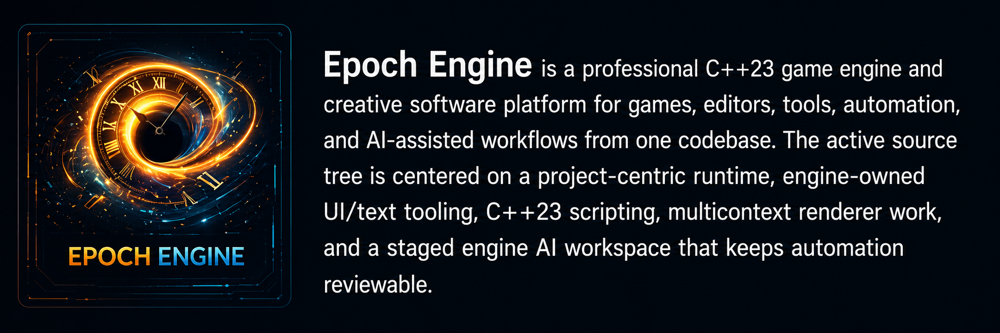
</p>

<p align="left">
  
  
  
  
  
  
  
  
  
  
</p>

<p align="center">
  <strong>Worlds First</strong>
</p>

<p align="center">
  
  
</p>

---

<p align="center">
  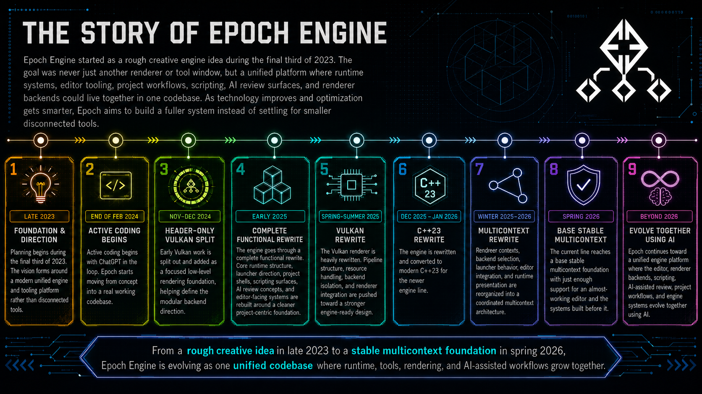
</p>

## What Epoch Is

For newcomers:

- Think of Epoch as one big workbench for making games and tools. Engines like
  Unity, Unreal, and Godot try to give you one main place to build things, and
  Epoch is aiming for that same kind of all-in-one home in its own way.
- The launcher is the front door. You pick a project, choose settings, check
  updates, and then open the editor.
- The editor is the work room. You can look at scenes, run the project, build
  scripts, check systems, and use AI tools there.
- The AI workspace has its own sub-workspaces. `Sandbox` is the separate
  self-iteration control room, `Harness` runs editor tool scripts and captures
  before/after state, `Assistant` is for normal game-engine/project guidance,
  `Launcher` tracks project/build evidence, and `Training` handles
  evidence-backed promotion.
- Epoch can also draw the same project in different ways. Those are called
  rendering backends, but you can think of them as different drawing engines
  under the hood.
- The downloadable builds are kept small on purpose. The full source code and
  the deeper engine work still live here in the repository.

For engine/tooling developers:

- active engine code lives under `Engine/src/`, `Engine/modules/`,
  `Engine/include/`, `Engine/resource/`, and `Engine/ai/`
- local MSVC runtime outputs usually live under `x64/Debug/` and `x64/Release/`
- Windows multicontext validation should run from asset-bearing output folders,
  not from the repo root
- the repo is moving toward one active product backend at a time in normal use:
  editor -> OpenGL today, Windows-native product rendering -> DirectX/D3D11 as
  it matures, and software kept as fallback/debug/headless support

## Current Snapshot

- Source is currently the active development line at `v0.84.73`.
- The latest published stable runtime release is `v0.84.38`.
- Windows and Linux `v0.84.38` runtime packages use the production package
  layout: one editor/runtime executable, a root `assets/` folder, and public
  README/LICENSE files. Generated atlases, source-shaped `Engine/` folders,
  headless smoke binaries, and duplicated compatibility output folders are not
  part of the public runtime payload.
- Windows and Linux packaged runtime assets now use versioned names such as
  `epoch_win10_x64_v*.zip` and `epoch_linux_x64_v*.tar.gz`.
- MSVC Debug/Release multicontext editor builds use the dynamic-vcpkg
  `x64-windows` lane so Raylib, SFML, SDL3, GLAD, OpenGL, Vulkan, and DirectX can
  coexist without static duplicate-symbol collisions. DLLs beside the debug
  executable are expected runtime dependencies for that editor lane.
- Bootstrap updater-shell releases are separate from the main runtime package
  and are meant to update into the current runtime release, then fall through
  to source only when packaged parity is already reached.
- Update/install policy is binary-first across install types: packaged Windows
  installs use the newest matching `.zip`, packaged Linux/WSL installs use the
  newest matching `.tar.gz`, and source checkouts rebuild from source only after
  packaged-runtime parity or when no newer packaged runtime exists.
- Phase 1 and Phase 2 of the active roadmap are complete. Current work is
  concentrated in systems tooling, time ownership, AI sandbox/capture, and UI
  maturity.

OS AI model, tooling, and evidence rules live with the AI assets in
`Engine/ai/README.md` and the engine policy docs.

## What Epoch Provides Right Now

- A project-centric runtime shell that creates, selects, builds, and plays real
  project shells instead of trapping the editor in fake sample flows.
- Top-level editor modes now route the center area into separate Scene/Game,
  Project, Assets, AI Sandbox, and Systems surfaces instead of forcing every
  workflow through the Perspective 3D view or the bottom console dock.
- The centered Run action now saves/builds normal generated projects before
  launching the selected single-context child output, while the engine
  self-iteration lane stays editor-shaped for visible manipulation/testing.
- The bottom Console Dock is status-only again: Project, Assets, AI, and
  Systems use the same compact selectable text-panel style as Output, while
  controls stay in central workspaces or the Inspector.
- Generated game and software/tool project shells with explicit build, script,
  output, and manifest proof surfaced in the editor.
- Non-GUI project-shell self-tests for Sandbox and ProjectLauncher, including
  `--editor-project-self-test <id>` from the checked-in engine and
  `--project-self-test` from generated child outputs.
- A non-GUI harness split between `--engine-contract-self-test` for pure
  Forest Factory/timeline/scene contracts and `--engine-validation-self-test`
  for the heavier project-profile plus OS-AI gate path.
- Engine-owned GUI/text rendering with reusable controls, workspace tabs,
  open/close panel visibility, and first-pass draggable splitters instead of
  middleware-owned editor UI.
- A `Game/2D` editor lane that reuses the same scene through a locked
  orthographic Canvas2D camera and upright editor-only canvas plane.
- Engine-owned C++23 scripting with project-local source resolution, validation,
  build actions, and runtime execution from the live shell.
- Editor-visible script/file/asset surfaces so Sandbox and Project Hub work
  can leave selectable paths, build/run notes, and first-pass asset cards.
- A first Package Manager modal for local runtime-mini packages, with future
  downloadable source/model packages constrained to explicit updater-style
  build/download gates.
- Multicontext renderer orchestration across Raylib, SDL3, SFML, Vulkan,
  OpenGL, software, and headless/noop paths.
- A Systems workspace with readable render/frame, task/thread, support-tier, and
  AI-loop graph surfaces for renderer/runtime ownership diagnostics.
- A 4D/time-based Timeline Editor surface backed by the shared `core.time`
  spine, with checkpoint stream configuration, manual/interval key staging, and
  deterministic scene snapshot serializer/parser contracts ready for the next
  persistence gate.
- A first `timeline.system` contract for editor tracks, keyed events, playhead
  scrubbing, recording gates, and scene-key conversion so timeline UI can grow
  from real 4D engine data instead of loose status buttons.
- Configurable streaming-save profiles and checkpoint records that make
  retention, output paths, scene/timeline inclusion, and manifest-line evidence
  visible before the full disk writer/restore loop is promoted.
- A build-safe `--engine-contract-self-test` lane that validates Forest Factory preview
  descriptors, streaming-save checkpoint behavior, and deterministic scene
  snapshot serialization plus parser round-trip before the heavier project/AI
  validation lanes.
- A staged AI workspace centered on an engine-owned OS-model harness around
  operator-selected `nvidia/NVIDIA-Nemotron-3-Nano-4B-BF16` and `Qwen/Qwen3.6-27B`
  coding/review lanes plus future Bonsai Image 4B, `Wan2.1-VACE-1.3B`, and
  `TRELLIS.2-4B` creative package lanes. Bonsai Ternary 4B is the preferred
  local image-generation lane, Bonsai Binary 4B is the low-memory option, and
  `FLUX.2-klein-4B` remains a higher-memory fallback. The self-iteration
  sandbox stages visible evidence before any promotion, downloads model weights
  only on demand into `cache/models/`, and includes model weights in generated
  projects only after explicit package opt-in and license/notice review.
- Executable-root asset, shader, script, font, log, and capture resolution so
  local runs stop depending on whatever folder the process happened to launch
  from.

## In Action

These proof images come from asset-bearing outputs, not stripped updater-shell
builds.

- A valid Windows six-context proof must visibly show `Raylib`, `SDL`, `SFML`,
  `Vulkan`, `OpenGL`, and `DirectX`.
- The floating-window proofs must show real promoted context windows outside
  the parent instead of fake launcher wrappers.
- The Linux proof comes from an asset-bearing WSL build output, not a source
  tree launched without runtime assets.

Windows fullscreen six-context multicontext proof, latest stable visual proof
from `v0.84.35`:

<p align="center">
  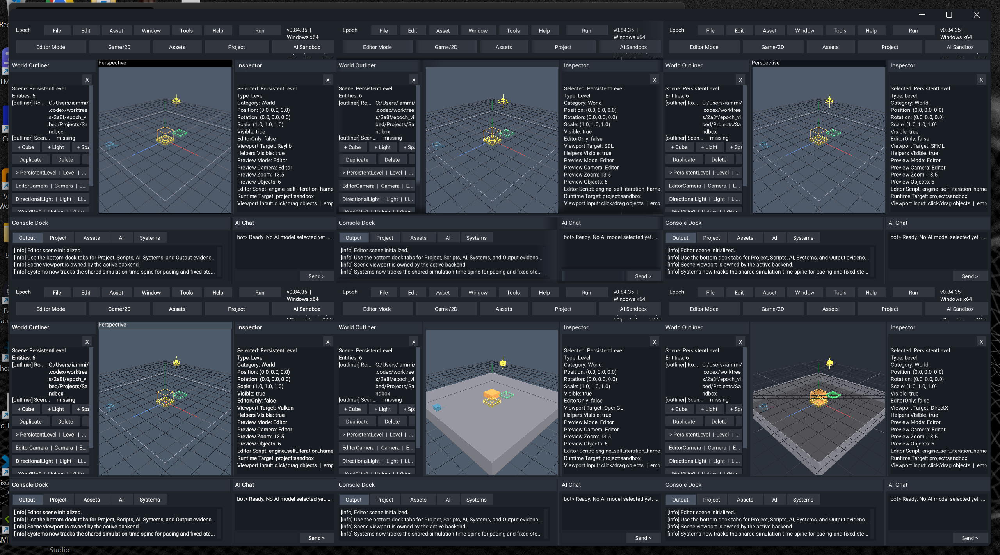
</p>

Current Windows per-backend startup proofs:

<p align="center">
  <a href="Images/readme/windows-raylib-v08435.png">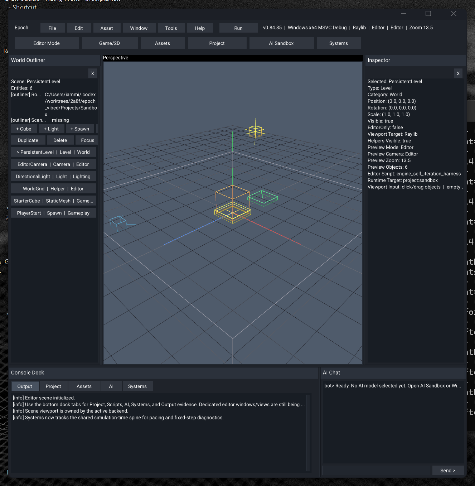</a>
  <a href="Images/readme/windows-sdl-v08435.png">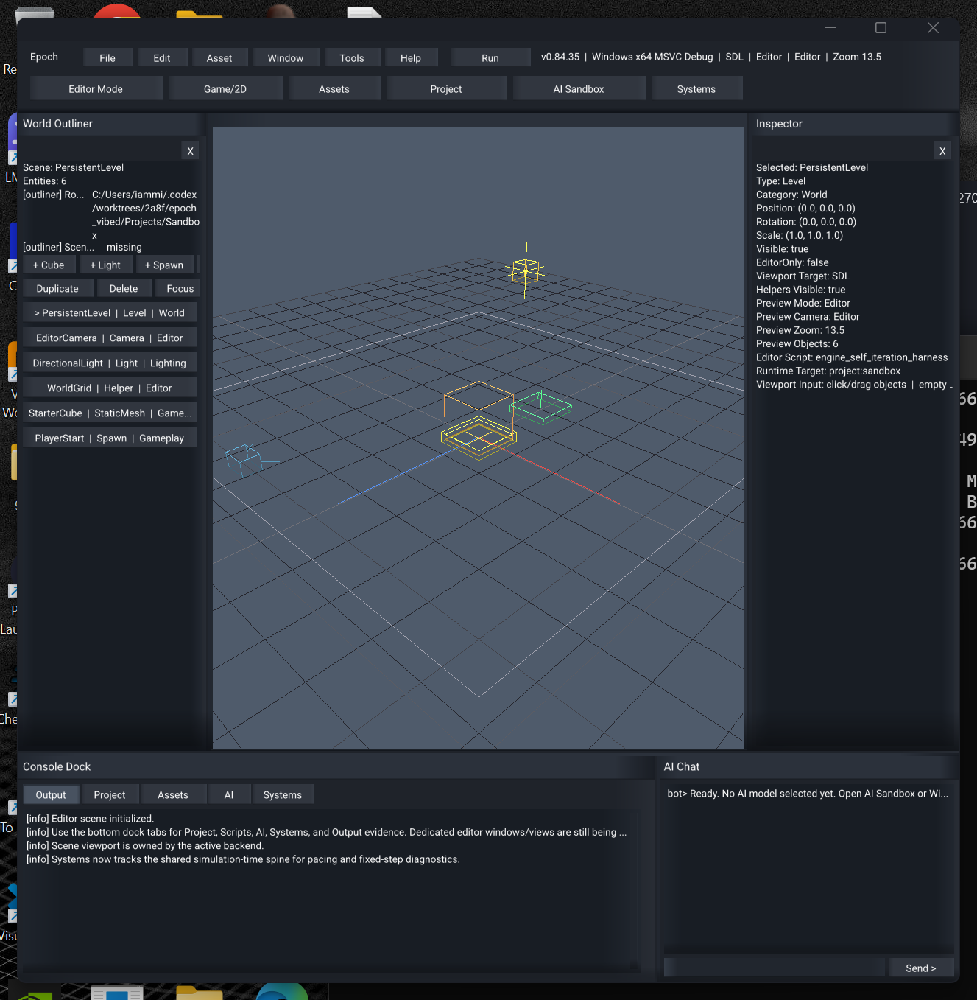</a>
  <a href="Images/readme/windows-sfml-v08435.png">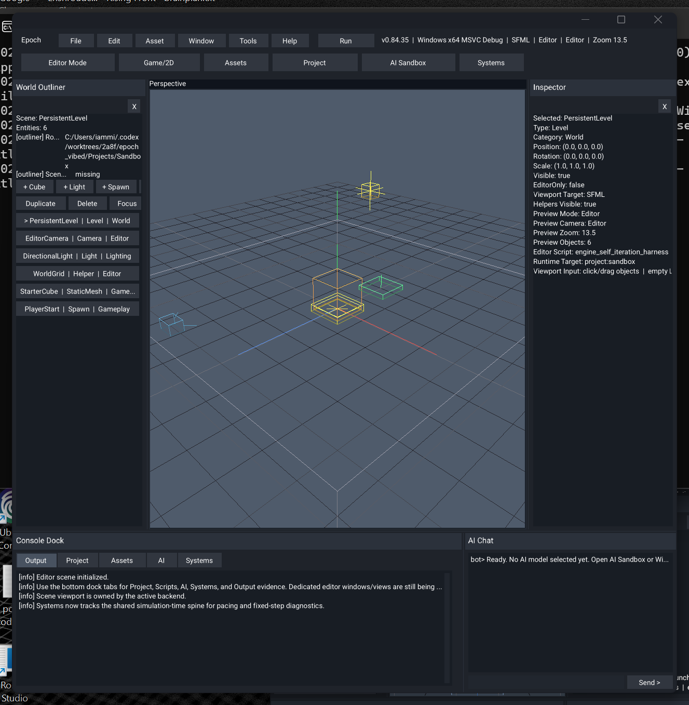</a>
  <a href="Images/readme/windows-vulkan-v08435.png">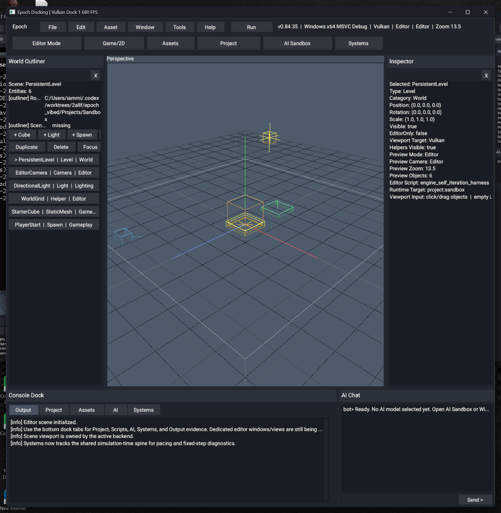</a>
  <a href="Images/readme/windows-opengl-v08435.png">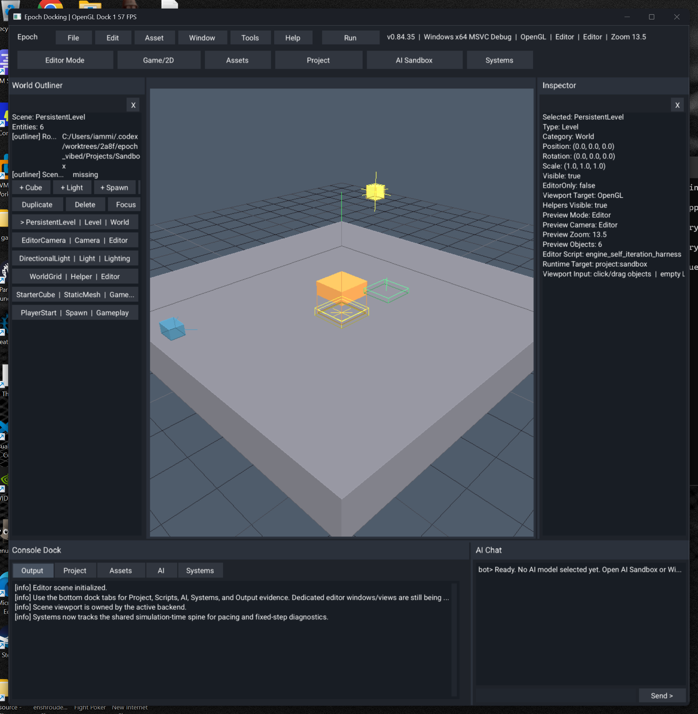</a>
  <a href="Images/readme/windows-directx-v08435.png">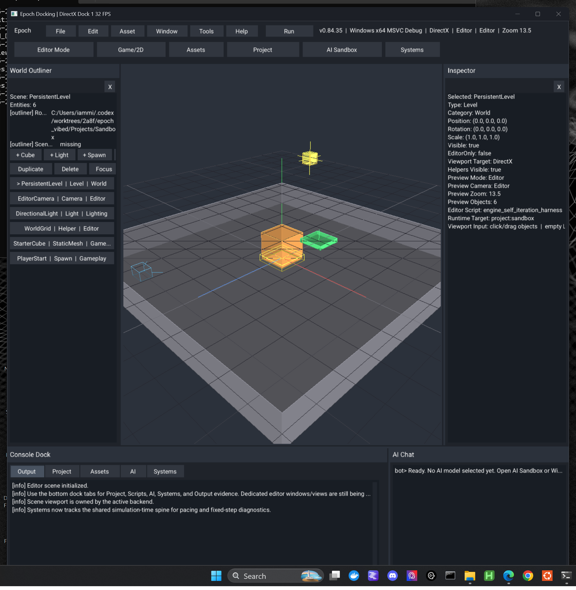</a>
</p>

Windows promoted-window and floating-context proof, live validation:

<p align="center">
  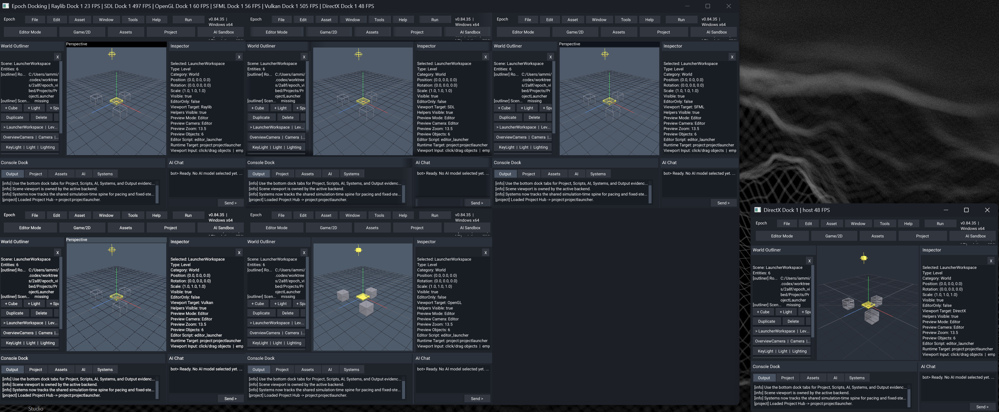
  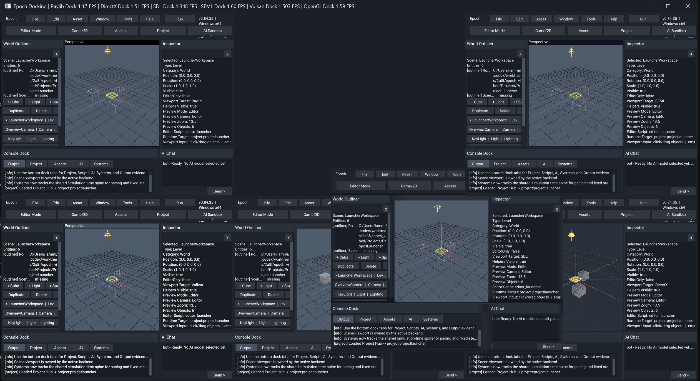
</p>

WSL/Linux editor proof, latest asset-bearing visual capture:

<p align="center">
  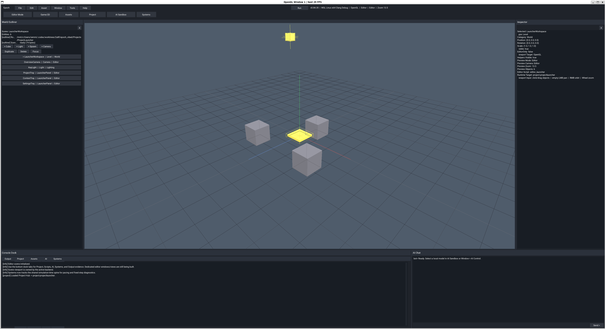
</p>

`v0.84.38` WSL Clang build/headless validation is green with DirectX disabled,
and WSL/OpenGL visual proof is current for the single-context Linux path.

## Quick Start

### Run the local Windows build

Launch from the binary directory so colocated assets resolve cleanly:

```powershell
Set-Location x64/Debug
.\EpochEditor.exe
```

Release build:

```powershell
Set-Location x64/Release
.\EpochEditor.exe
```

### Build with Visual Studio / MSBuild

Solution:

```text
Engine.sln
```

Typical configurations:

- `Debug | x64`
- `Release | x64`

Example app only:

```powershell
& "C:\Program Files\Microsoft Visual Studio\2022\Community\MSBuild\Current\Bin\MSBuild.exe" Engine.sln /t:ConsoleApplication1 /p:Configuration=Debug /p:Platform=x64 /m:1
```

Generated shell self-test:

```powershell
.\x64\Debug\EpochEditor.exe --editor-project-self-test sandbox
.\Projects\Sandbox\bin\windows\Debug\x64\Sandbox.exe --project-self-test
.\x64\Debug\EpochEditor.exe --editor-project-self-test projectlauncher
.\Projects\ProjectLauncher\bin\windows\Debug\x64\ProjectLauncher.exe --project-self-test
```

### Build with CMake

Windows MSVC:

```powershell
cmake --preset windows-msvc-debug
cmake --build --preset windows-msvc-debug
```

Linux:

```bash
cmake --preset ninja-clang-debug
cmake --build --preset ninja-clang-debug
```

Linux/GCC currently uses the headless validation presets by default because
GCC 14 can ICE while writing full-engine C++ module BMIs. Use
`ninja-gcc-debug` for headless validation, use Clang for full Linux engine
builds, or explicitly opt into the experimental GCC module path with
`-DEPOCH_ALLOW_GCC_MODULE_ENGINE=ON`.

Hosted CI mirrors that split: required portable lanes build/test headless, and
the Linux Clang engine lane builds the real `epoch` target with OpenGL,
software renderer, and SFML enabled at build time without launching GUI windows.

### Run under WSL/Linux

- use an asset-bearing output such as `Engine/Bin/Clang-Release/`
- launch `./epoch` from the output directory
- updater-shell mode is explicit/bootstrap-only on Linux/WSL, not the default
  runtime identity

## Repository Layout

```text
Engine/    engine code, internal source grouped toward platform/render, examples, assets, and docs
Changes/   changelog, roadmap, release-note archives, current planning text
Images/    README and repo artwork
Tools/     local helper scripts and validation utilities
x64/       MSVC local outputs with colocated runtime assets
```

## Documentation

Documentation index: [Engine/docs/README.md](Engine/docs/README.md)

If you're new:

- [Engine/docs/build/cmake_presets_and_builds.md](Engine/docs/build/cmake_presets_and_builds.md)
- [Engine/docs/build/local_build_scripts_and_release_packaging.md](Engine/docs/build/local_build_scripts_and_release_packaging.md)
- [Engine/docs/engine/runtime_and_editor_workflows.md](Engine/docs/engine/runtime_and_editor_workflows.md)
- [Engine/docs/platform/linux/linux_wsl_build_setup.md](Engine/docs/platform/linux/linux_wsl_build_setup.md)

If you're digging into engine behavior:

- [Engine/docs/engine/current_engine_architecture.md](Engine/docs/engine/current_engine_architecture.md)
- [Engine/docs/engine/backend_context_status.md](Engine/docs/engine/backend_context_status.md)
- [Engine/docs/engine/backend_menu_overlay_status.md](Engine/docs/engine/backend_menu_overlay_status.md)
- [Engine/docs/engine/os_ai_tooling_and_evidence_policy.md](Engine/docs/engine/os_ai_tooling_and_evidence_policy.md)
- [Engine/docs/engine/smoke_capture_and_screenshot_workflow.md](Engine/docs/engine/smoke_capture_and_screenshot_workflow.md)

Project planning and release history:

- [Changes/roadmap.md](Changes/roadmap.md)
- [Changes/changelog.txt](Changes/changelog.txt)
- [Changes/engine_history_and_release_archive.md](Changes/engine_history_and_release_archive.md)

## Roadmap Direction

The current roadmap is focused on:

1. Growing the Systems workspace into a stronger renderer/runtime ownership and
   pacing surface.
2. Carrying the time-system spine deeper into runtime and scene ownership.
3. Tightening the OS-model capture, review, and promotion loop with a
   separate self-iteration sandbox and watchable scene/tool evidence tasks.
4. Improving UI/editor maturity without regressing the honest project-centric
   runtime flow.

See [Changes/roadmap.md](Changes/roadmap.md) for the full phase-by-phase plan.

## License

```text
LicenseRef-MIT-NoSell
```

Epoch is free for non-commercial use. For commercial use or any legal edge
case, read [LICENSE](LICENSE) directly and follow the full agreement text
instead of relying on the README summary.
