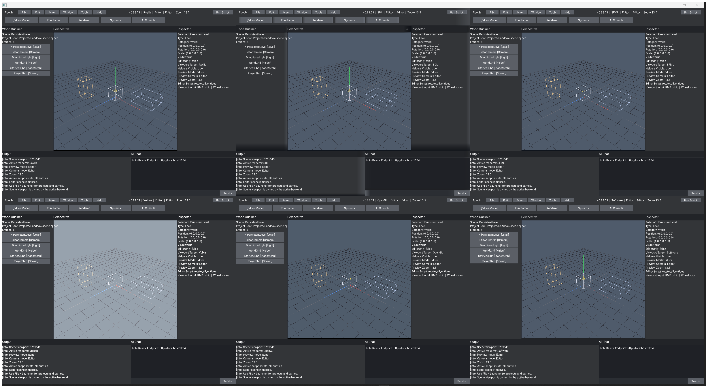

# Epoch - Creative Software And Game Engine

**Epoch Engine** is a **world-class, modules-first, AI-enabled C++23 game
engine** built for serious real-time tooling: internal engine bootstrap,
multi-context rendering, launcher + editor workflow, atlas-driven UI,
engine-owned compiled scripting, and a runtime that can drive multiple
backends at once without giving up engine-level control.

The active engine lives in:

```text
Engine/src/
Engine/include/
Engine/modules/
Engine/resource/
```

with prebuilt MSVC runtime binaries commonly landing in:

```text
x64/Debug/
x64/Release/
```

Those binary folders also carry runtime assets, so launching from the binary
directory is the safest default for local testing.

For Windows multi-context smoke tests, prefer launching directly from
`x64/Debug/` or `x64/Release/` so docked SDL/SFML/Vulkan panes see the same
asset set as the main editor host.

---

# What Epoch provides

- Internalized engine bootstrap and entry-point flexibility. Epoch can own the
  desktop startup path itself or be embedded with handled/headless entry
  configurations through the active `EPOCH_*` runtime macros. See
  [configuration flags](Engine/docs/aengineconfig_flags.md) and
  [runtime operations](Engine/docs/runtime_operations.md).
- Multi-context, multi-backend runtime orchestration across OpenGL, Vulkan,
  SDL3, Raylib, SFML, software, and noop/headless paths.
- Launcher-first workflow that routes projects into the editor and games into
  scene/runtime mode, instead of treating the editor as a loose debug shell.
- Desktop-style editor workflow with scene preview control, command surfaces,
  and backend-aware fallback behavior.
- Atlas-driven GUI, sprite, and text pipelines shared across the runtime rather
  than copied independently into each backend.
- ECS-style systems, scene plumbing, gameplay modules, and engine-owned runtime
  state.
- Engine-owned compiled scripting with editor-triggered run actions, a host API
  for runtime/editor callbacks, and task-graph-backed asynchronous work
  scheduling.
- Diagnostics, renderer telemetry, runtime logging, and updater plumbing as
  first-class engine systems.
- Cross-platform build freedom: Visual Studio, MSBuild, CMake presets, VS Code,
  shell-script workflows, and multiple compiler families across Windows, Linux,
  and macOS.
- Module-first public engine surface centered around active C++23 modules and
  the exported [epochengine module](Engine/modules/epochengine.ixx).

---

# In action

These README captures are editor/source proofs, not updater-shell screenshots.
If a packaged bootstrap release looks older than these, it has not caught up to
the current source/editor state yet.

Windows editor six-context camera/control refresh, source `v0.83.53`:

<p align="center">
  
</p>

---

Windows editor backend proofs, source `v0.83.41`:

<p align="center">
  
  
  
</p>

---

WSL/Linux editor proof, source `v0.83.42`:

<p align="center">
  
</p>

WSL/Linux note:

- The Linux screenshot above comes from the engine's own frame capture under WSLg, which avoids the extra-window behavior that can make desktop grabs misleading.
- The broader Linux multi-window view is still visually inconsistent under WSLg, so the README is using the clean single-backend editor proof for now.

---

# Repository layout

```text
Engine/
```

Engine code, build configuration, resources, examples, docs, assets, and
editor/runtime systems.

```text
x64/
```

MSVC runtime outputs and colocated runtime assets for local launches.

```text
Changes/
```

Active changelog, roadmap, and current release notes.

```text
Images/
```

Repository artwork and README assets.

```text
Tools/
```

Local helper scripts and tooling notes.

---

# Build systems

## Visual Studio 2022

Open the solution at:

```text
Engine.sln
```

Typical configuration:

- `Debug | x64`
- `Release | x64`

Primary engine project surfaces:

- [Engine/Engine.vcxitems](Engine/Engine.vcxitems)
- [Engine/examples/StaticLib1/StaticLib1.vcxproj](Engine/examples/StaticLib1/StaticLib1.vcxproj)
- [Engine/examples/ConsoleApplication1/ConsoleApplication1.vcxproj](Engine/examples/ConsoleApplication1/ConsoleApplication1.vcxproj)

## MSBuild

From the repository root in Developer PowerShell:

```powershell
& "C:\Program Files\Microsoft Visual Studio\2022\Community\MSBuild\Current\Bin\MSBuild.exe" Engine.sln /t:Rebuild /p:Configuration=Debug /p:Platform=x64 /m:1
```

To build the example app only:

```powershell
& "C:\Program Files\Microsoft Visual Studio\2022\Community\MSBuild\Current\Bin\MSBuild.exe" Engine.sln /t:ConsoleApplication1 /p:Configuration=Debug /p:Platform=x64 /m:1
```

## CMake Presets

Presets live at [Engine/CMakePresets.json](Engine/CMakePresets.json).

Windows MSVC:

```powershell
Set-Location Engine
cmake --preset x64-debug
cmake --build --preset x64-debug
```

Windows Clang:

```powershell
Set-Location Engine
cmake --preset clang-x64-debug
cmake --build --preset clang-x64-debug
```

Windows GCC / MinGW:

```powershell
Set-Location Engine
cmake --preset gcc-x64-debug
cmake --build --preset gcc-x64-debug
```

Linux:

```bash
cd Engine
cmake --preset Ninja-Debug
cmake --build --preset Ninja-Debug
```

macOS:

```bash
cd Engine
cmake --preset macos-debug
cmake --build --preset macos-debug
```

## VS Code

VS Code workspace configuration lives in:

```text
Engine/.vscode/
```

Key files:

- [Engine/.vscode/tasks.json](Engine/.vscode/tasks.json)
- [Engine/.vscode/launch.json](Engine/.vscode/launch.json)
- [Engine/.vscode/settings.json](Engine/.vscode/settings.json)
- [Engine/.vscode/c_cpp_properties.json](Engine/.vscode/c_cpp_properties.json)
- [Engine/.vscode/cmake-kits.json](Engine/.vscode/cmake-kits.json)

Recommended flow:

1. Open `Engine/` in VS Code.
2. Select a CMake preset or task matching your compiler.
3. Build through the bundled tasks or the CMake Tools extension.

## Shell scripts

Scripted build helpers:

- [Engine/build.sh](Engine/build.sh)
- [Engine/run.sh](Engine/run.sh)
- [Engine/install.sh](Engine/install.sh)
- [Engine/clean.sh](Engine/clean.sh)

Examples:

```bash
cd Engine
./build.sh gcc Release
./run.sh gcc Release
```

WSL note:

- The packaged Linux updater shell can also be smoke-tested under Windows WSL2.
- Use a WSLg/X11 setup with working OpenGL, extract the Linux release asset inside WSL, then launch `./epoch`.
- The Linux updater shell now prefers OpenGL by default on Linux/WSL; you can still force `--backend software` if you need the CPU path.

---

# Running the MSVC binaries

Launch from the binary directory so the colocated assets resolve cleanly:

```powershell
Set-Location x64/Debug
.\ConsoleApplication1.exe
```

Release build:

```powershell
Set-Location x64/Release
.\ConsoleApplication1.exe
```

Relevant runtime asset roots:

- `x64/Debug/assets/`
- `x64/Release/assets/`
- `Engine/assets/`

---

# Documentation map

Documentation index: [Engine/docs/README.md](Engine/docs/README.md)

Useful entry points:

- [Engine/docs/build_presets.md](Engine/docs/build_presets.md)
- [Engine/docs/build_scripts.md](Engine/docs/build_scripts.md)
- [Engine/docs/tools_list.md](Engine/docs/tools_list.md)
- [Engine/docs/runtime_operations.md](Engine/docs/runtime_operations.md)
- [Engine/docs/aengineconfig_flags.md](Engine/docs/aengineconfig_flags.md)
- [Engine/docs/engine_analysis.md](Engine/docs/engine_analysis.md)
- [Engine/docs/context_audit.md](Engine/docs/context_audit.md)
- [Engine/docs/menu_overlay_backend_audit.md](Engine/docs/menu_overlay_backend_audit.md)
- [Engine/docs/renderer_regression_plan.md](Engine/docs/renderer_regression_plan.md)
- [Engine/docs/wsl_vcpkg_setup.md](Engine/docs/wsl_vcpkg_setup.md)
- [Changes/release_notes_archive.md](Changes/release_notes_archive.md)

---

# Current snapshot

Version:

```text
v0.83.53
```

Highlights:

- `0.83.53` adds held left-drag panning in the editor viewport on top of the
  existing right-drag orbit and wheel zoom controls.
- The preview now shows a visible look-hit marker where the center camera ray
  meets the grid, making the current focus spot readable in multi-context runs.
- The software renderer now tracks camera revisions directly and reduces
  repeated telemetry churn so it spends less time redrawing stale editor frames.
- The refreshed 4K six-context editor proof above was captured from the real
  asset-bearing `x64/Debug` runtime so it matches the current local launch path.
- The repo still keeps Windows resources under `Engine/resource/`, separate
  from both implementation code and module interfaces.
- Detailed release history lives in [Changes/changelog.txt](Changes/changelog.txt),
  [Changes/release_notes_archive.md](Changes/release_notes_archive.md), and the
  current version notes under [Changes/](Changes/).

Changelog:

[Changes/changelog.txt](Changes/changelog.txt)

Roadmap:

[Changes/roadmap.txt](Changes/roadmap.txt)

---

# License

```text
LicenseRef-MIT-NoSell
```

See [LICENSE](LICENSE) for full terms.
