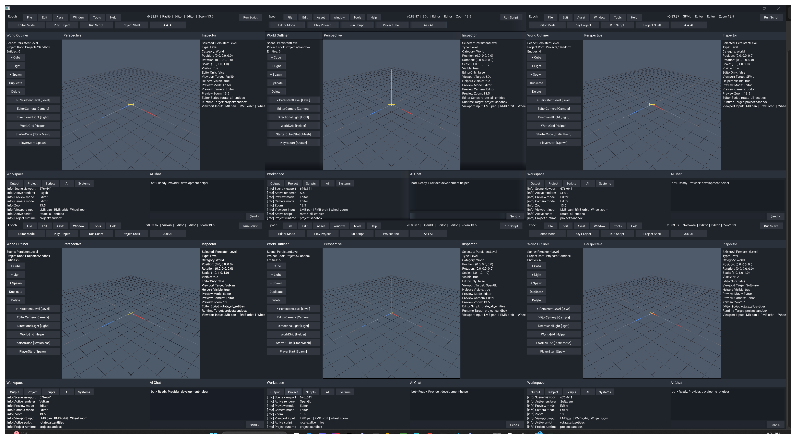
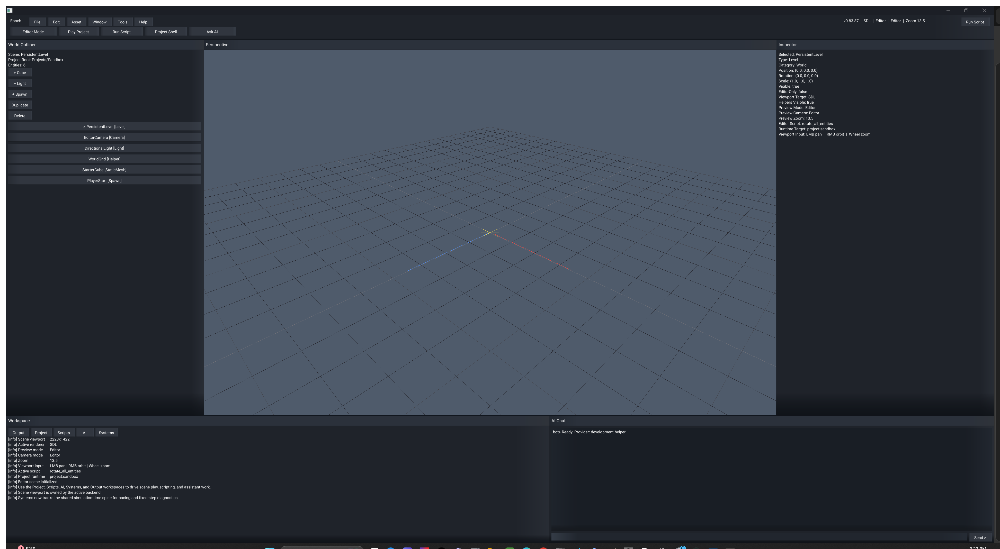
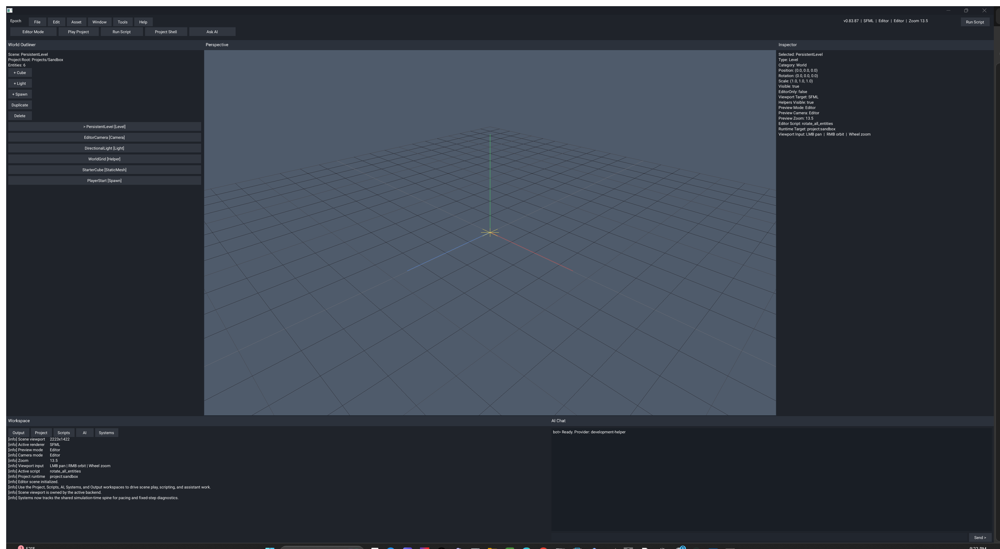
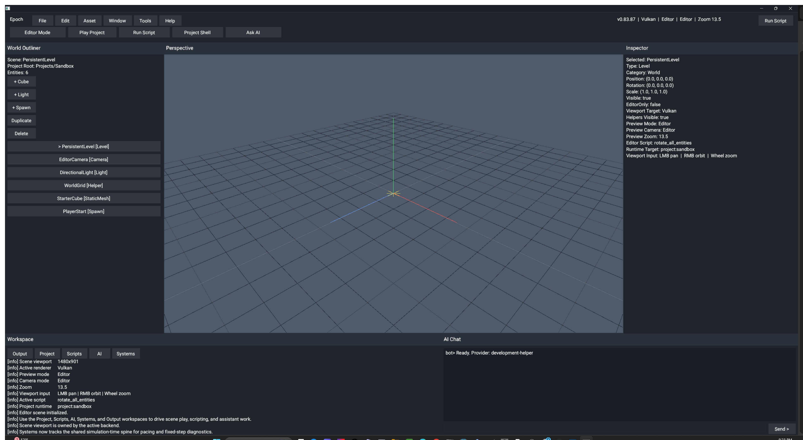
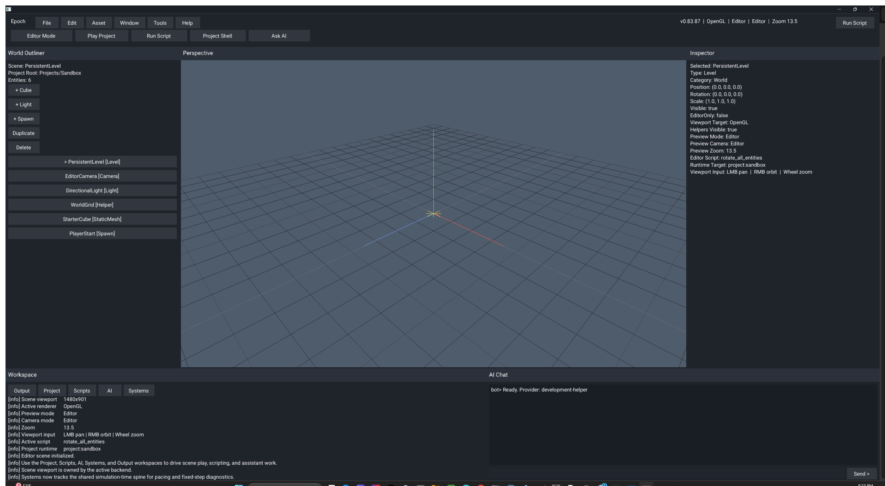
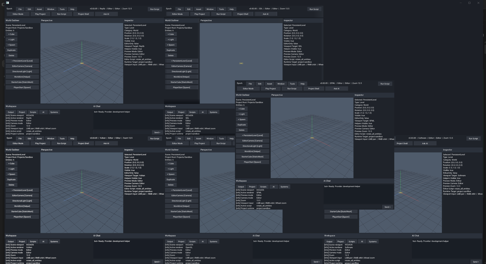
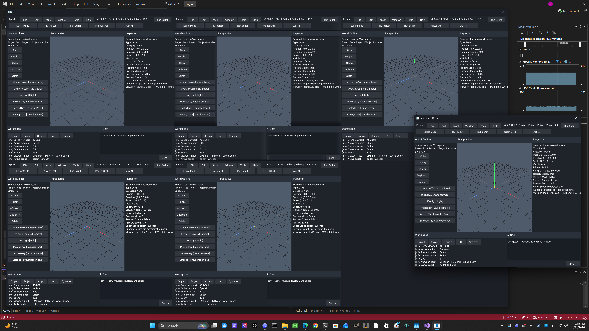
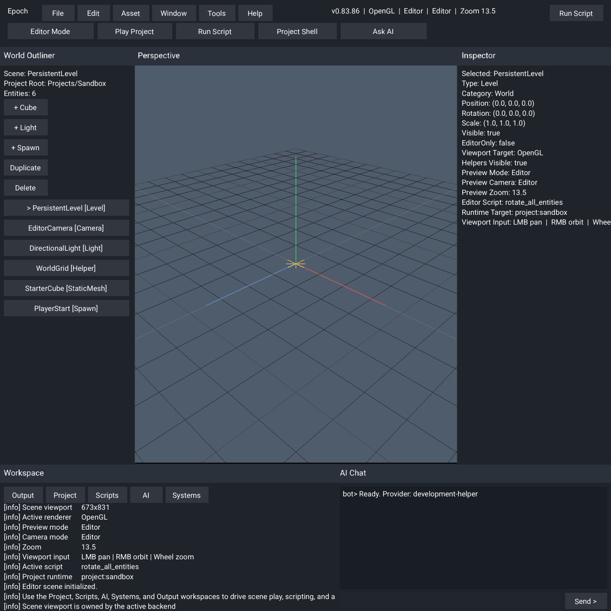

# Epoch - Creative Software And Game Engine

<p align="left">
  
  
</p>


**Epoch Engine** is a professional **C++23 game engine and creative software
platform** for games, editors, tools, automation, and AI-assisted workflows
from one codebase. The active source tree is centered on a project-centric
runtime, engine-owned UI/text tooling, C++23 scripting, multicontext renderer
work, and a staged two-role AI workspace that keeps automation reviewable.

<p align="left">
  
  
  
  
</p>

---

## The Story Of Epoch Engine

Epoch planning started in the last third of 2024. By the end of February 2025,
active coding had begun with ChatGPT in the loop, and development has
continued from there into the current engine line. What started as a rough
creative engine idea has been turning into a real project-centric runtime and
tooling platform with a working editor, launcher, project shells, scripting,
AI review surfaces, and multicontext renderer work all living in one codebase.
Epoch is also born from the idea that as technology improves, and as
optimization and good programming get smarter, a better and fuller system can
be fostered instead of settling for smaller disconnected tools.

Current feature spine:

- Project-centric runtime flow with separate launcher and editor surfaces.
- Real project creation, discovery, build, and play flow from the live editor.
- Engine-owned GUI and text rendering instead of middleware-owned editor UI.
- C++23 scripting with validation, build, reload, and runtime execution.
- Multicontext backend orchestration across Raylib, SDL3, SFML, Vulkan,
  OpenGL, software, and noop/headless paths.
- Model-backed launcher demo flow using the embedded Mini Sponza asset.
- Systems, Scripts, Project, AI, and Output workspaces inside the editor.
- Two-role AI loop centered on `EpochBot` plus the local MCP/control layer.
- Executable-root path and asset resolution instead of fragile cwd-based runs.
- Windows, Linux/WSL, updater-shell, and packaged runtime workflows with
  documented release/source policy.

## What Epoch Is

For newcomers:

- Think of Epoch as one big workbench for making games and tools. Engines like
  Unity, Unreal, and Godot try to give you one main place to build things, and
  Epoch is aiming for that same kind of all-in-one home in its own way.
- The launcher is the front door. You pick a project, choose settings, check
  updates, and then open the editor.
- The editor is the work room. You can look at scenes, run the project, build
  scripts, check systems, and use AI tools there.
- Epoch can also draw the same project in different ways. Those are called
  rendering backends, but you can think of them as different drawing engines
  under the hood.
- The downloadable builds are kept small on purpose. The full source code and
  the deeper engine work still live here in the repository.

For engine/tooling developers:

- active engine code lives under `Engine/src/`, `Engine/modules/`,
  `Engine/include/`, `Engine/resource/`, and `Engine/ai/`
- local MSVC runtime outputs usually live under `x64/Debug/` and `x64/Release/`
- Windows multicontext validation should run from asset-bearing output folders,
  not from the repo root
- the repo is moving toward one active backend at a time in normal use:
  editor -> OpenGL, launcher -> software, with explicit switching and teardown

## Current Snapshot

- Source is currently the active development line at `v0.83.88`.
- The latest published stable runtime release is `v0.83.86`.
- Windows and Linux packaged runtime assets now use versioned names such as
  `epoch_win10_x64_v*.zip` and `epoch_linux_x64_v*.tar.gz`.
- Bootstrap updater-shell releases are separate from the main runtime package
  and are meant to update into the current runtime release, then fall through
  to source only when packaged parity is already reached.
- Phase 1 and Phase 2 of the active roadmap are complete. Current work is
  concentrated in systems tooling, time ownership, AI control/capture, and UI
  maturity.

## What Epoch Provides Right Now

- A project-centric runtime shell that creates, selects, builds, and plays real
  project shells instead of trapping the editor in fake sample flows.
- Generated game and software/tool project shells with explicit build, script,
  output, and manifest proof surfaced in the editor.
- Engine-owned GUI/text rendering with reusable controls and workspace tabs
  instead of middleware-owned editor UI.
- Engine-owned C++23 scripting with project-local source resolution, validation,
  build actions, and runtime execution from the live shell.
- Multicontext renderer orchestration across Raylib, SDL3, SFML, Vulkan,
  OpenGL, software, and headless/noop paths.
- A Systems workspace that already shows real renderer/runtime tooling surfaces
  and is being extended with pacing and ownership diagnostics.
- A time-system spine with fixed-step ownership, pause/resume, scaling,
  single-step, and early editor-facing diagnostics.
- A staged AI workspace centered on two in-engine roles only:
  `EpochBot` and the local MCP/control layer.
- Executable-root asset, shader, script, font, log, and capture resolution so
  local runs stop depending on whatever folder the process happened to launch
  from.

## In Action

These proof images come from asset-bearing outputs, not stripped updater-shell
builds.

- A valid Windows six-context proof must visibly show `Raylib`, `SDL`, `SFML`,
  `Vulkan`, `OpenGL`, and `Software`.
- The undock proof must show a real promoted window outside the parent.
- The redock proof beside it is a live desktop capture so the detached and
  returned states can be compared directly.
- The Linux proof comes from an asset-bearing WSL build output, not a source
  tree launched without runtime assets.

Windows fullscreen six-context multicontext proof, source `v0.83.87`:

<p align="center">
  
</p>

Current Windows per-backend startup proofs:

<p align="center">
  <a href="Images/readme/windows-raylib-v08387.png"></a>
  <a href="Images/readme/windows-sdl-v08387.png"></a>
  <a href="Images/readme/windows-sfml-v08387.png"></a>
  <a href="Images/readme/windows-vulkan-v08387.png"></a>
  <a href="Images/readme/windows-opengl-v08387.png"></a>
  <a href="Images/readme/windows-software-v08387.png"></a>
</p>

Windows promoted-window undock proof, live validation:

<p align="center">
  
  
</p>

WSL/Linux editor proof, latest asset-bearing WSL capture:

<p align="center">
  
</p>

## Quick Start

### Run the local Windows build

Launch from the binary directory so colocated assets resolve cleanly:

```powershell
Set-Location x64/Debug
.\ConsoleApplication1.exe
```

Release build:

```powershell
Set-Location x64/Release
.\ConsoleApplication1.exe
```

### Build with Visual Studio / MSBuild

Solution:

```text
Engine.sln
```

Typical configurations:

- `Debug | x64`
- `Release | x64`

Example app only:

```powershell
& "C:\Program Files\Microsoft Visual Studio\2022\Community\MSBuild\Current\Bin\MSBuild.exe" Engine.sln /t:ConsoleApplication1 /p:Configuration=Debug /p:Platform=x64 /m:1
```

### Build with CMake

Windows MSVC:

```powershell
Set-Location Engine
cmake --preset x64-debug
cmake --build --preset x64-debug
```

Linux:

```bash
cd Engine
cmake --preset Ninja-Debug
cmake --build --preset Ninja-Debug
```

### Run under WSL/Linux

- use an asset-bearing output such as `Engine/Bin/Clang-Release/`
- launch `./epoch` from the output directory
- updater-shell mode is explicit/bootstrap-only on Linux, not the default

## Repository Layout

```text
Engine/    engine code, internal source grouped toward platform/render, examples, assets, and docs
Changes/   changelog, roadmap, release-note archives, current planning text
Images/    README and repo artwork
Tools/     local helper scripts and validation utilities
x64/       MSVC local outputs with colocated runtime assets
```

## Documentation

Documentation index: [Engine/docs/README.md](Engine/docs/README.md)

If you're new:

- [Engine/docs/build/cmake_presets_and_builds.md](Engine/docs/build/cmake_presets_and_builds.md)
- [Engine/docs/build/local_build_scripts_and_release_packaging.md](Engine/docs/build/local_build_scripts_and_release_packaging.md)
- [Engine/docs/engine/runtime_and_editor_workflows.md](Engine/docs/engine/runtime_and_editor_workflows.md)
- [Engine/docs/platform/linux/linux_wsl_build_setup.md](Engine/docs/platform/linux/linux_wsl_build_setup.md)

If you're digging into engine behavior:

- [Engine/docs/engine/current_engine_architecture.md](Engine/docs/engine/current_engine_architecture.md)
- [Engine/docs/engine/backend_context_status.md](Engine/docs/engine/backend_context_status.md)
- [Engine/docs/engine/backend_menu_overlay_status.md](Engine/docs/engine/backend_menu_overlay_status.md)
- [Engine/docs/engine/ai_training_memory_and_dataset_policy.md](Engine/docs/engine/ai_training_memory_and_dataset_policy.md)
- [Engine/docs/engine/smoke_capture_and_screenshot_workflow.md](Engine/docs/engine/smoke_capture_and_screenshot_workflow.md)

Project planning and release history:

- [Changes/roadmap.md](Changes/roadmap.md)
- [Changes/changelog.txt](Changes/changelog.txt)
- [Changes/engine_history_and_release_archive.md](Changes/engine_history_and_release_archive.md)

## Roadmap Direction

The current roadmap is focused on:

1. Growing the Systems workspace into a stronger renderer/runtime ownership and
   pacing surface.
2. Carrying the time-system spine deeper into runtime and scene ownership.
3. Tightening the two-role AI capture, review, and promotion loop.
4. Improving UI/editor maturity without regressing the honest project-centric
   runtime flow.

See [Changes/roadmap.md](Changes/roadmap.md) for the full phase-by-phase plan.

## License

```text
LicenseRef-MIT-NoSell
```

Epoch is free for non-commercial use. For commercial use or any legal edge
case, read [LICENSE](LICENSE) directly and follow the full agreement text
instead of relying on the README summary.
