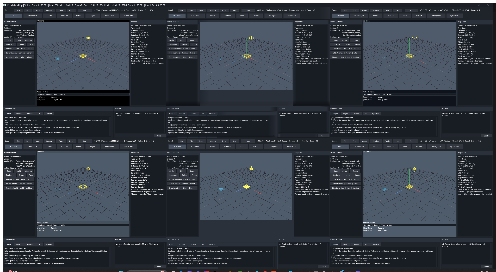

[](https://github.com/Autodidac/EpochEngine/actions/workflows/cmake-multi-platform.yml)
[](https://github.com/Autodidac/EpochEngine/actions/workflows/msbuild.yml)

# Epoch - Creative Software And Game Engine

<p align="left">
  
  
</p>

<p align="center">
  
</p>

<p align="left">
  
  
  
  
  
  
  
  
  
  
</p>

<p align="center">
  <strong>Worlds First</strong>
</p>

<p align="center">
  
  
</p>

---

<p align="center">
  
</p>

## What Epoch Is

For newcomers:

- Think of Epoch as one big workbench for making games and tools. Engines like
  Unity, Unreal, and Godot try to give you one main place to build things, and
  Epoch is aiming for that same kind of all-in-one home in its own way.
- The launcher is the front door. You pick a project, choose settings, check
  updates, and then open the editor.
- The editor is the work room. You can look at scenes, run the project, build
  scripts, check systems, and use AI tools there.
- The AI workspace has its own sub-workspaces. `Sandbox` is the separate
  self-iteration control room, `Harness` runs editor tool scripts and captures
  before/after state, `Assistant` is for normal game-engine/project guidance,
  `Launcher` tracks project/build evidence, and `Training` handles
  evidence-backed promotion.
- Epoch can also draw the same project in different ways. Those are called
  rendering backends, but you can think of them as different drawing engines
  under the hood.
- The downloadable builds are kept small on purpose. The full source code and
  the deeper engine work still live here in the repository.

For engine/tooling developers:

- active engine code lives under `Engine/src/`, `Engine/modules/`,
  `Engine/include/`, `Engine/resource/`, and `Engine/ai/`
- local MSVC runtime outputs usually live under `x64/Debug/` and `x64/Release/`
- Windows multicontext validation should run from asset-bearing output folders,
  not from the repo root
- the repo is moving toward one active product backend at a time in normal use:
  editor -> OpenGL today, Windows-native product rendering -> DirectX/D3D11 as
  it matures, and software kept as fallback/debug/headless support

## Current Snapshot

- Active development source is `v0.88.73`; the published Windows/Linux runtime
  baseline remains `v0.88.69`.
- The runtime release and updater are sealed. Source development advances
  independently without changing packaged-version defaults, release assets, or
  update behavior.
- Epoch now has one forward plan:
  [the capability-tier architecture](Engine/docs/engine/capability_tier_architecture.md).
  It selects implementations per subsystem and operation from `T0-CPU` through
  proven GLES, OpenGL, Vulkan, DirectX, and future ray tiers.
- The immediate product target is a playable baseline 2D project that can be
  authored, saved, reopened, run, and built through the normal project workflow.
- Current source includes renderer-neutral math, bounded lighting, CPU ray
  queries, temporal texture-document contracts, deterministic physics/audio
  managers, sparse voxel and water foundations, a canonical Tier-0 scene, and
  capability/evidence reporting in Settings and System Info.
- Operator proof accepts SDL3, SFML3, DirectX, and Software solid orientation.
  Raylib and Vulkan correction plus Vulkan replacement teardown remain `Partial`
  until the `v0.88.73` candidate receives visual and repeated-switch proof.
  Backend status is recorded in the
  [renderer feature matrix](Engine/docs/engine/renderer_feature_matrix.md), not
  inferred from API names or build success alone.

## In Action

The image below demonstrates Epoch's multicontext diagnostic shell. Normal
editor work owns one active backend; multicontext remains a comparison and
validation tool rather than the runtime selection model.

<p align="center">
  
</p>

## What Epoch Provides Right Now

- A project-centric launcher/editor/runtime flow with project-owned scene data,
  generated project shells, single-context runs, and build-safe contract tests.
- A canonical Tier-0 default scene with camera, ground, directional light,
  spawn, starter object, ray-based selection, and working Focus behavior.
- Backend-neutral capability profiles, budgets, proof stages, and deterministic
  per-subsystem fallback selection; settings expose current evidence instead of
  unsupported feature switches.
- A shared renderer/resource spine used by OpenGL, DirectX, Vulkan, Raylib,
  SDL3, SFML3, software, and headless paths without making any API authoritative
  engine state.
- C++23 EpochGui controls for windows, tabs, selection, text, font/image/input,
  layouts, rounded rectangles, popups, panels, docking, and optional desktop
  floating-window hosts.
- Temporal world and authoring contracts that separate stable documents and
  semantic history from compiled artifacts and disposable physical caches.
- Package and extension gates for optional terrain, voxel, ocean, networking,
  and technique-gallery work in
  [EpochEngineExtensions](https://github.com/Autodidac/EpochEngineExtensions).

## Evidence

Current capability truth lives in the
[renderer feature matrix](Engine/docs/engine/renderer_feature_matrix.md).
Architecture and delivery state live in
[Engine/docs/README.md](Engine/docs/README.md) and `Changes/`. Images under
`Images/readme/` are retained as visual evidence archives; version-specific
release chronology belongs in [Changes/changelog.txt](Changes/changelog.txt).
## Quick Start

### Run the local Windows build

Launch from the binary directory so colocated assets resolve cleanly:

```powershell
Set-Location x64/Debug
.\EpochEditor.exe
```

Release build:

```powershell
Set-Location x64/Release
.\EpochEditor.exe
```

### Build with Visual Studio / MSBuild

Solution:

```text
Engine.sln
```

Typical configurations:

- `Debug | x64`
- `Release | x64`

Example app only:

```powershell
& "C:\Program Files\Microsoft Visual Studio\2022\Community\MSBuild\Current\Bin\MSBuild.exe" Engine.sln /t:ConsoleApplication1 /p:Configuration=Debug /p:Platform=x64 /m:1
```

Generated shell self-test:

```powershell
.\x64\Debug\EpochEditor.exe --editor-project-self-test sandbox
.\Projects\Sandbox\bin\windows\Debug\x64\Sandbox.exe --project-self-test
.\x64\Debug\EpochEditor.exe --editor-project-self-test projectlauncher
.\Projects\ProjectLauncher\bin\windows\Debug\x64\ProjectLauncher.exe --project-self-test
```

### Build with CMake

Windows MSVC:

```powershell
cmake --preset windows-msvc-debug
cmake --build --preset windows-msvc-debug
```

Linux:

```bash
cmake --preset ninja-clang-debug
cmake --build --preset ninja-clang-debug
```

Linux/GCC 16 uses the headless validation presets by default while the
full-engine GNU C++ module lane remains experimental. Use `ninja-gcc-debug`
for headless validation, use the current Clang toolchain for full Linux engine
builds, or explicitly opt into the experimental GCC module path with
`-DEPOCH_ALLOW_GCC_MODULE_ENGINE=ON`.

Hosted CI mirrors that split: required portable lanes build/test headless, and
the Linux Clang engine lane builds the real `epoch` target with OpenGL,
software renderer, and SFML enabled at build time without launching GUI windows.

### Run under WSL/Linux

- use an asset-bearing output such as `Engine/Bin/Clang-Release/`
- launch `./epoch` from the output directory
- updater-shell mode is explicit/bootstrap-only on Linux/WSL, not the default
  runtime identity

## Repository Layout

```text
Engine/    engine code, internal source grouped toward platform/render, examples, assets, and docs
Changes/   changelog, roadmap, release-note archives, current planning text
Images/    README and repo artwork
Tools/     local helper scripts and validation utilities
x64/       MSVC local outputs with colocated runtime assets
```

## Documentation

Documentation index: [Engine/docs/README.md](Engine/docs/README.md)

If you're new:

- [Engine/docs/build/cmake_presets_and_builds.md](Engine/docs/build/cmake_presets_and_builds.md)
- [Engine/docs/build/local_build_scripts_and_release_packaging.md](Engine/docs/build/local_build_scripts_and_release_packaging.md)
- [Engine/docs/engine/runtime_and_editor_workflows.md](Engine/docs/engine/runtime_and_editor_workflows.md)
- [Engine/docs/platform/linux/linux_wsl_build_setup.md](Engine/docs/platform/linux/linux_wsl_build_setup.md)

If you're digging into engine behavior:

- [Engine/docs/engine/capability_tier_architecture.md](Engine/docs/engine/capability_tier_architecture.md)`n- [Engine/docs/engine/temporal_engine_architecture.md](Engine/docs/engine/temporal_engine_architecture.md)`n- [Engine/docs/engine/temporal_authoring_platform.md](Engine/docs/engine/temporal_authoring_platform.md)
- [Engine/docs/engine/backend_context_status.md](Engine/docs/engine/backend_context_status.md)
- [Engine/docs/engine/backend_menu_overlay_status.md](Engine/docs/engine/backend_menu_overlay_status.md)
- [Engine/docs/engine/os_ai_tooling_and_evidence_policy.md](Engine/docs/engine/os_ai_tooling_and_evidence_policy.md)
- [Engine/docs/engine/smoke_capture_and_screenshot_workflow.md](Engine/docs/engine/smoke_capture_and_screenshot_workflow.md)

Project planning and release history:

- [Changes/roadmap.md](Changes/roadmap.md)
- [Changes/changelog.txt](Changes/changelog.txt)
- [Changes/engine_history_and_release_archive.md](Changes/engine_history_and_release_archive.md)

## Roadmap Direction

The next eight weeks are focused on one acceptance loop:

```text
capability/project profile
-> temporal textures and residency
-> Canvas2D compose and sprite batches
-> tilemap and scene authoring
-> input, deterministic 2D physics, audio, and animation
-> Play, Run, Build, save, reopen, and cache regeneration
```

The canonical architecture is
[Engine/docs/engine/capability_tier_architecture.md](Engine/docs/engine/capability_tier_architecture.md).
The bounded current gate is [Changes/active_pass.md](Changes/active_pass.md), and
[Changes/roadmap.md](Changes/roadmap.md) owns the delivery schedule.
## License

```text
LicenseRef-MIT-NoSell
```

Epoch is free for non-commercial use. For commercial use or any legal edge
case, read [LICENSE](LICENSE) directly and follow the full agreement text
instead of relying on the README summary.
