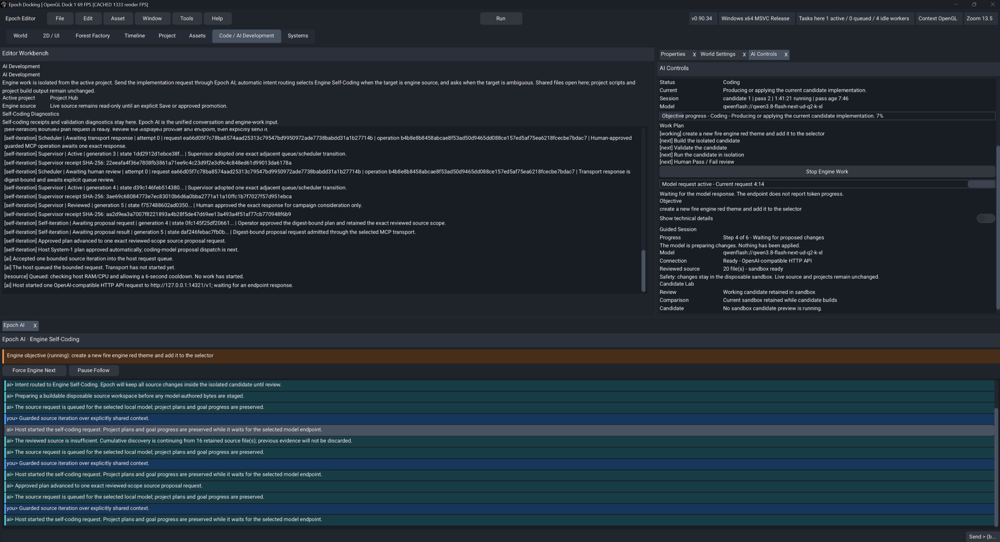

# EpochEngine — Software And Game Engine

<p align="left">
  
  
</p>

EpochEngine is a C++23 engine and workbench for software and games. This GitHub
repository contains its development source. The optional Editor shares engine
services with generated CLI, platform-window and graphics applications.

## Current Update

Source **v0.90.35** consolidates the October 7 repairs:

- Source files are organized by subsystem, with synchronized CMake/MSVC paths
  and filters plus source-layout/dependency guards.
- Source discovery retains accepted evidence transactionally. Failed reads or
  unchanged fallback excerpts no longer masquerade as new coding progress.
- Model requests preserve provider error causes and expose real received-byte,
  event, phase and last-activity information when streaming is supported.
  These are not fabricated token counts; complete-response endpoints cannot
  reveal intermediate generation activity.
- Windows input cancels held state on focus loss and rejects covered-window
  pointer input. Native interaction acceptance remains operator-owned.
- The same Windows projects provide Debug, Release, ReleaseWithDebugInfo and
  BuildAll. No extra combined-build project exists. CMake/MSVC now consume the
  same portable EpochGui implementation sources.
- Candidate source snapshots retain root build policy and CMake helpers while
  dependencies, runtime data and compiler output keep separate ownership.

Production Windows builds for all three configurations, the CMake BuildAll
workflow, pure engine contracts and 15/15 CPU tests pass. This is a **source
checkpoint**, not a claim that native Qwen → build → docked candidate → choice
→ successor has passed. Windows/Linux published runtimes remain **v0.90.33**;
macOS remains **v0.89.30**. Historical release tags and packages are unchanged.

Exact delivery status: [source checkpoint](Changes/source_sync_2026-10-07.md).
Remaining acceptance: [active pass](Changes/active_pass.md).

## Editor And AI Workspace

<p align="center">
  
</p>

This operator-supplied **v0.90.34** screenshot shows the real unified Epoch AI
workbench and cumulative source discovery. It is diagnostic evidence, not a
successful candidate-build or successor screenshot. Old screenshots remain
archived under `Images/readme/`; they are not relabeled as current-release proof.

Normal work uses one active renderer. Multicontext tooling supports comparison,
movable panes and diagnostic contexts; it does not make every backend equally
complete. Backend implementation and visual acceptance are tracked in the
[renderer feature matrix](Engine/docs/engine/renderer_feature_matrix.md).

## What Is In The Engine

- Project launcher, optional Editor, project-owned data and generated software/
  game profiles with separate runtime entry points.
- OpenGL event-driven scene caching, bounded damage reconstruction, previous
  object-bound invalidation, selective/full A/B diagnostics and full-frame
  fallback. Neuromorphic CPU signals feed conservative invalidation; learned
  perception and autonomous training are not claimed.
- Renderer-neutral scene, camera, lighting, Canvas2D, texture artifacts/residency,
  tile-map, temporal history, physics/audio and capability contracts.
- OpenGL, DirectX/D3D11, Vulkan, SDL3, SFML3, Raylib and Software integrations
  with different evidence levels—not blanket parity claims.
- Reusable [EpochGui](https://github.com/Autodidac/EpochGui) controls, docking,
  text/input, panels, popups and floating-window primitives. The bundled mirror
  is pinned and checked; engine-specific integration stays outside that mirror.
- Optional [EpochEngineExtensions](https://github.com/Autodidac/EpochEngineExtensions)
  packages. The bundled descriptor/terrain compatibility fixture is not the
  complete upstream package repository.

## Build Modes

Windows/MSVC uses the **existing projects** in `Engine.sln`:

| Mode | Result |
| --- | --- |
| Debug | Debug build and debug CRT |
| Release | Optimized release build, without generated debug symbols |
| ReleaseWithDebugInfo | Optimized release CRT/NDEBUG build with PDB symbols |
| BuildAll | CMake builds Debug, Release and RelWithDebInfo sequentially |

BuildAll creates no fourth executable and stops on failure. Direct MSVC outputs
are `x64/Debug`, `x64/Release` and `x64/ReleaseWithDebugInfo`. BuildAll outputs are
under `build/windows-msvc-debug/Engine/<configuration>`.

```powershell
& "C:\Program Files\Microsoft Visual Studio\2022\Community\MSBuild\Current\Bin\MSBuild.exe" Engine.sln /t:EpochEditor /p:Configuration=Debug /p:Platform=x64 /m:1

cmake --workflow --preset windows-msvc-both # Debug then Release
cmake --workflow --preset windows-msvc-all  # All three Windows configurations
```

Portable helpers retain Debug/Release; no Linux release-with-debug preset was
added. For a configured multi-config tree:

```text
cmake -DBINARY_DIR=<tree> -P Tools/CMake/build_configurations.cmake
```

Linux full-engine validation uses the current Clang toolchain:

```bash
cmake --preset ninja-clang-debug
cmake --build --preset ninja-clang-debug
ctest --preset ninja-clang-debug
```

GCC presets are headless by default while full GNU module support remains
experimental. Requirements and detailed commands:
[CMake builds](Engine/docs/build/cmake_presets_and_builds.md),
[local scripts](Engine/docs/build/local_build_scripts_and_release_packaging.md).

## Run And Find Your Files

Launch from an asset-bearing output directory, not the source root:

```powershell
Set-Location x64/Release
.\EpochEditor.exe
```

| Location | Ownership |
| --- | --- |
| Tracked `Engine/`, `Tools/`, root build inputs | Canonical engine source; keep |
| `Projects/<project>` | Durable authored project data; keep |
| `x64/`, `build/`, `Engine/Bin/` | Reproducible compiler output; not source |
| Candidate session source and lineage | Sandbox edits/evidence; retain chosen or recoverable ancestry |
| Candidate private data root | Mutable preview/test state, separate from validated inputs |
| Executable-local ordinary cache buckets | Disposable downloads/model/atlas cache, not project source |

Choose Candidate retains its sandbox as the next iteration's parent. It does
**not** overwrite the original engine or project. Promotion to canonical source
requires a separate reviewed transaction. Path routing and process supervision
are not a claim of OS security confinement.

[Folder guide](Engine/docs/engine/repository_layout_reference.txt) ·
[runtime/editor workflows](Engine/docs/engine/runtime_and_editor_workflows.md)

## Documentation And Direction

[Documentation index](Engine/docs/README.md) · [Roadmap](Changes/roadmap.md) ·
[Mission cache](Changes/mission_cache.md) · [Changelog](Changes/changelog.txt)

The immediate gate is useful local-model sandbox coding with compiler repair,
independent docked comparison, Keep/Choose and a second validated successor.
Then stabilize the reusable editor-free software/context base before broader
EpochPlatformEngine work. GUI/Extensions, Sim/Space demos, private SDK access,
temporal tools and a fully playable 2D product remain ordered goals.

Architecture:
[capability tiers](Engine/docs/engine/capability_tier_architecture.md),
[temporal engine](Engine/docs/engine/temporal_engine_architecture.md),
[neuromorphic framework](Engine/docs/engine/neuromorphic_engine_framework.md),
[AI discovery](Engine/docs/engine/ai_source_discovery_architecture.md).

## License

`LicenseRef-MIT-NoSell`. Read [LICENSE](LICENSE) for the actual terms.
